# SafePay: implemented functionality and application flows

**Source snapshot: 11 September 2026.** This guide describes the current backend source, including the recent request-body, validation, reservation, concurrency, and response changes. It is a description of expected behavior from source inspection; a complete application and Oracle integration test run has not been completed.

> SafePay is a simulated risk-adaptive pre-settlement transaction-control layer.

SafePay records simulated outgoing payments in its own database. An amount-based risk assessment determines whether a payment settles immediately, receives a short cancellable protection window, or remains in a hard hold. There is no connection to real NEFT, RTGS, IMPS, or UPI rails, and no implemented recipient-account credit operation.

For runnable requests, use the [Postman testing guide](SafePay_Postman_Testing.md), import the [Postman collection](../postman/SafePay.postman_collection.json), and select the [local environment](../postman/SafePay.local.postman_environment.json).

## 1. What is implemented

| Area | Current functionality | Important behavior |
|---|---|---|
| Registration | Register through either `/api/auth/register` or `/api/users` | Creates a user and one account with a ₹5,000.00 balance in one database transaction. |
| Password storage | BCrypt hashing on registration and password updates | Password is write-only JSON; no login or password-verification endpoint exists. |
| User management | Create, list, retrieve, update, delete | Deletion is rejected while the user has any account. |
| Account management | Create additional accounts, list, retrieve, replace balance, delete | A ₹5,000 minimum must remain; balance updates must also cover all reserved payments. |
| Beneficiaries | Add, list by owner email, set ACTIVE or INACTIVE | Each beneficiary belongs to one account; outgoing payment must use that account and an ACTIVE beneficiary. |
| Payment initiation | Validate, check ownership, reserve available money, assess risk, persist payment | Requires `Idempotency-Key`; matching retries reuse the existing payment. |
| LOW risk | Immediate settlement | Sender balance decreases during initiation. |
| MEDIUM risk | 10-second protection window | Amount is reserved; cancellation is allowed strictly before database expiry. |
| HIGH risk | 60-second protection window | Same cancellation behavior with a longer window. |
| HARD_HOLD | Persist authentication-required hold | No release, authentication, or cancellation endpoint is implemented for this state. |
| Cancellation | Cancel a protected payment before expiry | Stores a separate cancellation idempotency key; replaying that successful cancellation is supported. |
| Auto-settlement | Scheduled scan every 5 seconds | Each expired protected payment settles in its own database transaction. |
| Status and history | Retrieve a payment; list all or filter by state | History is ordered newest first, using creation time then transaction ID. |
| Concurrency | Database user/account locks and conditional state/version/deadline updates | Prevents overlapping supported operations from spending the same reserved funds or both cancelling and settling a payment. |
| Explainability and audit | Persist risk tier/reason and transaction audit rows | Audit covers initiation, cancellation, and scheduled settlement; no audit-read endpoint exists. |
| Validation and errors | Required fields, formats, decimal limits, readable 400/404/409 responses | Database conflicts do not expose SQL in the API response. |

## 2. Architecture and stored relationships

### Diagram 1 — Request and scheduled execution architecture

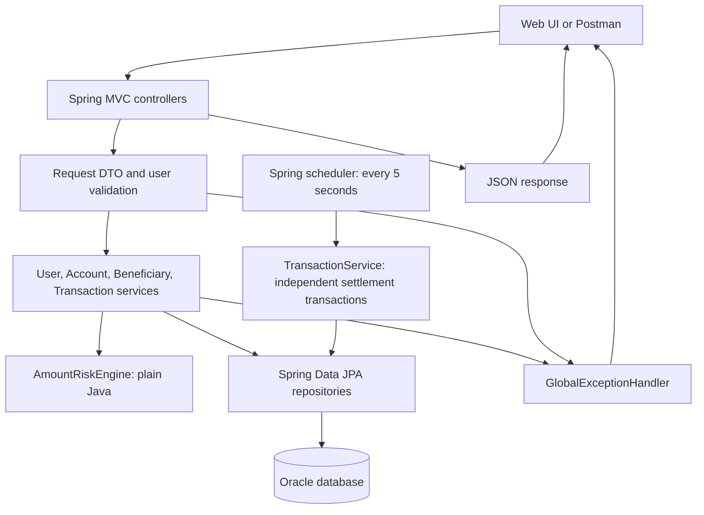

The application uses Java 17, Spring Boot, Spring MVC, Hibernate/Spring Data JPA, Oracle sequences, and Maven. Scheduling is enabled in `SafePayApplication`. The current configuration uses Hibernate `ddl-auto=update`. Database rows are the source of payment state and reservation totals; a browser timer does not authorize settlement or cancellation.

Source: [application entry point](../src/main/java/com/ofss/SafePayApplication.java), [controllers](../src/main/java/com/ofss/controller), [services](../src/main/java/com/ofss/services), [repositories](../src/main/java/com/ofss/repository).

### Diagram 2 — Data model

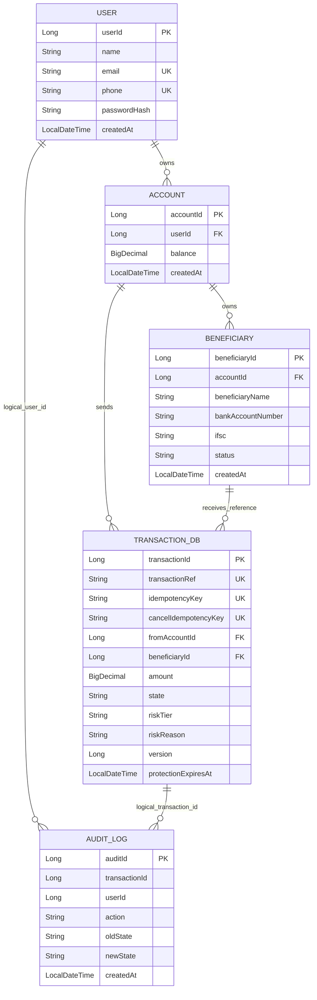

`AUDIT_LOG` stores scalar user/transaction IDs in Java; the diagram shows their logical references, not JPA object associations. The beneficiary is a stored destination description, not a second internal account that receives a credit. Beneficiary uniqueness is the combination of account ID, bank account number, and IFSC.

Money uses Java `BigDecimal` and `NUMBER(18,2)` mappings. Transaction fields also include purpose, protection seconds, authentication-required flag, and created/authorized/released/settled/cancelled timestamps. IDs are generated with Oracle sequences; clients should use returned IDs instead of assuming initial sequence values.

Source: [entity classes](../src/main/java/com/ofss/beans).

## 3. Exact endpoint inventory

Default local base URL: `http://localhost:8080`. All request bodies below are JSON. Send `Content-Type: application/json` when supplying a JSON body. No bearer token is used by the current implementation.

| Method | Path | Query parameters | Body / required header | Success |
|---|---|---|---|---|
| POST | `/api/auth/register` | None | User creation body | 201; registration summary |
| POST | `/api/users` | None | User creation body | 201; user |
| GET | `/api/users` | None | None | 200; user array |
| GET | `/api/users/{userId}` | None | None | 200; user |
| PUT | `/api/users/{userId}` | None | User update body | 200; user |
| DELETE | `/api/users/{userId}` | None | None | 204; no body |
| GET | `/accounts` | `userEmail` optional | None | 200; account array |
| GET | `/accounts/{accountId}` | None | None | 200; account |
| POST | `/accounts` | `userId` required | Account body | 200; account |
| PUT | `/accounts/{accountId}` | None | Account body | 200; account |
| DELETE | `/accounts/{accountId}` | None | None | 200; empty body |
| POST | `/api/beneficiaries` | None | Add-beneficiary body | 200; beneficiary |
| GET | `/api/beneficiaries` | `userEmail` required | None | 200; beneficiary array |
| PATCH | `/api/beneficiaries/{beneficiaryId}/status` | None | Beneficiary-status body | 200; beneficiary |
| POST | `/api/transactions/initiate` | None | Initiation body; `Idempotency-Key` header | 200; transaction response |
| GET | `/api/transactions/{transactionId}` | `userEmail` required | None | 200; transaction response |
| GET | `/api/transactions` | `userEmail` required; `state` optional | None | 200; transaction array |
| POST | `/api/transactions/{transactionId}/cancel` | None | Cancellation body; `Idempotency-Key` header | 200; transaction response |

There are **18 route mappings**. Account routes use `/accounts`, without `/api`. Transaction history uses **`state`**, not `status`. POST/PATCH transaction and beneficiary inputs are in JSON; GET filtering still uses query parameters, and account creation still takes `userId` in its query string.

`userEmail` identifies which user's rows to select. It is supplied by the caller and is **not authentication**. User CRUD and account-by-ID CRUD are not scoped by a logged-in identity. An omitted account-list email returns accounts for all users.

Source: [AuthController](../src/main/java/com/ofss/controller/AuthController.java), [UserController](../src/main/java/com/ofss/controller/UserController.java), [AccountController](../src/main/java/com/ofss/controller/AccountController.java), [BeneficiaryController](../src/main/java/com/ofss/controller/BeneficiaryController.java), [TransactionController](../src/main/java/com/ofss/controller/TransactionController.java).

## 4. Request and response contracts

The IDs in these examples are illustrative. Obtain actual IDs from registration/account/beneficiary responses.

### User creation and update

Creation through either registration route:

```json
{
  "name": "Demo Customer",
  "email": "customer@example.com",
  "phone": "9876543210",
  "password": "DemoPassword123"
}
```

`PUT /api/users/{userId}` requires `name`, `email`, and `phone`. Include `password` only to replace it; omission or JSON `null` preserves the saved password. A supplied blank password is rejected. User IDs and creation timestamps are server-controlled for registration. The request field is `password`, not `passwordHash`.

`POST /api/auth/register` returns `{userId, email, message}`. Other user responses contain `{userId, name, email, phone, createdAt}`. Passwords are excluded from responses.

### Account creation and balance replacement

```json
{
  "balance": 500000.00
}
```

For creation, send this to `/accounts?userId=<returned-user-id>`. For replacement, send it to `/accounts/{accountId}`. Replacement sets the total stored balance; it is not an increment or deposit operation.

Account response: `{accountId, balance, createdAt}`. It does not contain the nested user or a calculated reserved/spendable balance.

### Add a beneficiary

```json
{
  "accountId": 1000001,
  "userEmail": "customer@example.com",
  "beneficiaryName": "Demo Payee",
  "bankAccountNumber": "123456789012",
  "ifsc": "SBIN0001234"
}
```

The service sets status to `ACTIVE` and assigns the ID/timestamp. Response fields are `{beneficiaryId, accountId, beneficiaryName, bankAccountNumber, ifsc, status, createdAt}`. The owning account is exposed by ID, without nested account data.

### Change beneficiary status

```json
{
  "status": "INACTIVE",
  "userEmail": "customer@example.com"
}
```

Send to `PATCH /api/beneficiaries/{beneficiaryId}/status`. Use `ACTIVE` to reactivate. Setting the status already stored on that beneficiary is allowed. Deactivation prevents a new payment from passing the ACTIVE check; it does not automatically cancel or stop settlement of an existing protected payment.

### Initiate a payment

Required header: `Idempotency-Key: <a-new-key-for-this-payment>`.

```json
{
  "fromAccountId": 1000001,
  "beneficiaryId": 1,
  "amount": 25000.00,
  "purpose": "Demo transfer",
  "userEmail": "customer@example.com"
}
```

`purpose` is optional. Omission, JSON `null`, and the empty string are stored as `null`. Other strings are not trimmed or case-normalized.

### Cancel a payment

Required header: `Idempotency-Key: <a-new-key-for-this-cancellation>`.

```json
{
  "userEmail": "customer@example.com"
}
```

Send to `POST /api/transactions/{transactionId}/cancel`. Use the **same cancellation key** when retrying that cancellation. Initiation and cancellation keys occupy separate unique columns; use distinct descriptive keys for clarity.

### Transaction response

All transaction endpoints return the same field set; the history endpoint wraps these objects in an array.

| Field | Meaning |
|---|---|
| `transactionId` | Database-generated ID used in status/cancellation URLs. |
| `transactionRef` | Reference shaped as `TXN-` plus an uppercase UUID. |
| `state`, `riskTier` | Persisted transaction state and amount-based risk tier. |
| `amount`, `purpose` | Amount and optional purpose. |
| `fromAccountId` | Sending account ID. |
| `beneficiaryId`, `beneficiaryName` | Destination beneficiary ID and name. |
| `riskReason` | Persisted plain-language range explanation. |
| `protectionSeconds` | 0, 10, or 60 according to tier. |
| `authenticationRequired` | JSON boolean; true for HARD_HOLD. Stored as Y/N internally. |
| `protectionExpiresAt` | Timestamp string for a payment that entered protection; **empty string** if absent. Retained after cancellation or scheduled settlement. |
| `createdAt`, `authorizedAt` | Initiation timestamps. |
| `releasedAt` | Set during scheduled release; otherwise null. |
| `settledAt` | Set when settlement occurs; otherwise null. |
| `cancelledAt` | Set when cancellation occurs; otherwise null. |

These Java timestamps use `LocalDateTime`; they carry no UTC offset. Transaction timing and expiry decisions use database local time. User/account/beneficiary creation uses application local time. Do not infer a timezone suffix that the response does not contain.

The response omits raw idempotency keys and the optimistic-lock version. Replaying initiation returns the payment's **current persisted representation**, which may have changed since its original initiation response. Use `state` when deciding which actions to show; an expiry timestamp alone does not mean a transaction is still cancellable.

## 5. User and account flows

### Diagram 3 — Registration

```mermaid
sequenceDiagram
    participant C as Client
    participant A as AuthController or UserController
    participant S as UserService
    participant D as Oracle
    C->>A: POST name, email, phone, password
    A->>A: Validate creation fields
    A->>S: register(user)
    S->>D: Check existing email and phone
    alt Duplicate
        S-->>C: 409 conflict
    else New user
        S->>S: Check password bytes; clear supplied ID; BCrypt hash
        S->>D: Save user with creation time
        S->>D: Save account with balance 5000.00
        Note over S,D: Both writes commit or roll back together
        S-->>A: Saved user
        A-->>C: 201 registration summary or user
    end
```

A new account's entire ₹5,000 balance is the minimum balance. Its initial spendable amount is therefore **₹0**, even though the account exists. Increase its simulated balance or create a funded additional account before sending a payment. Registration does not return an account ID; retrieve it using the account-list endpoint with the registered email.

### Diagram 4 — User CRUD and deletion guard

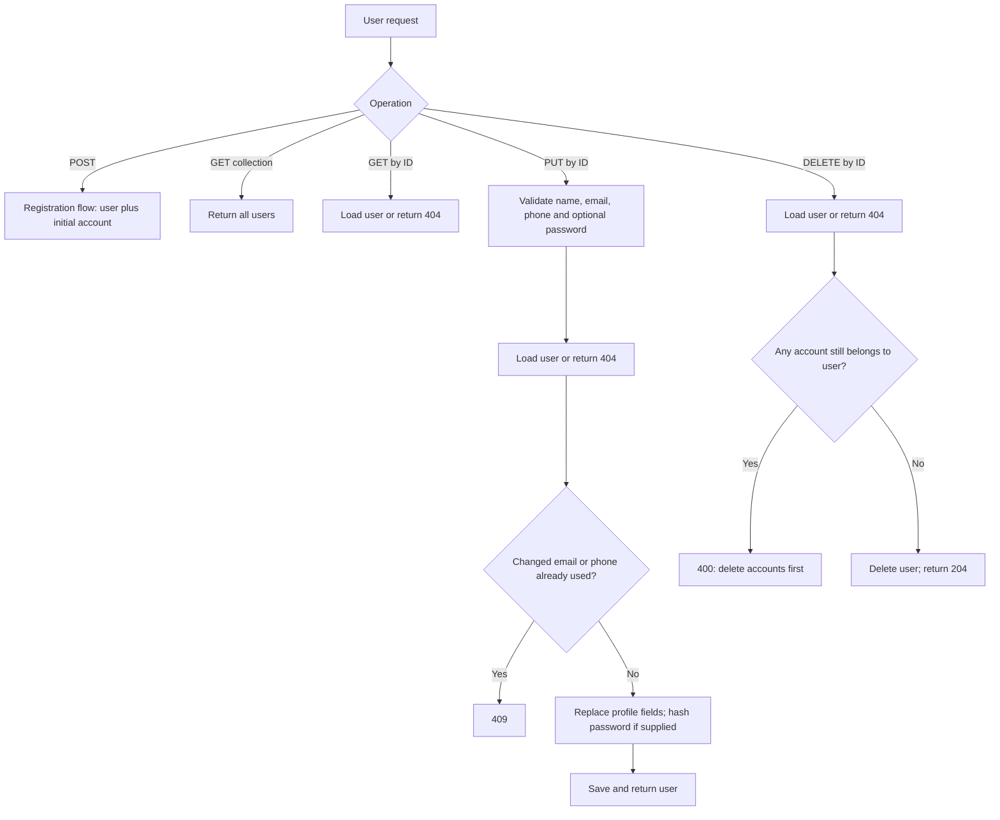

`PUT` replaces the three profile fields; it is not a partial profile patch. Current code does not normalize email case or trim fields. A user's latest email must be used in later owner-filtered requests.

### Diagram 5 — Account CRUD and reservations

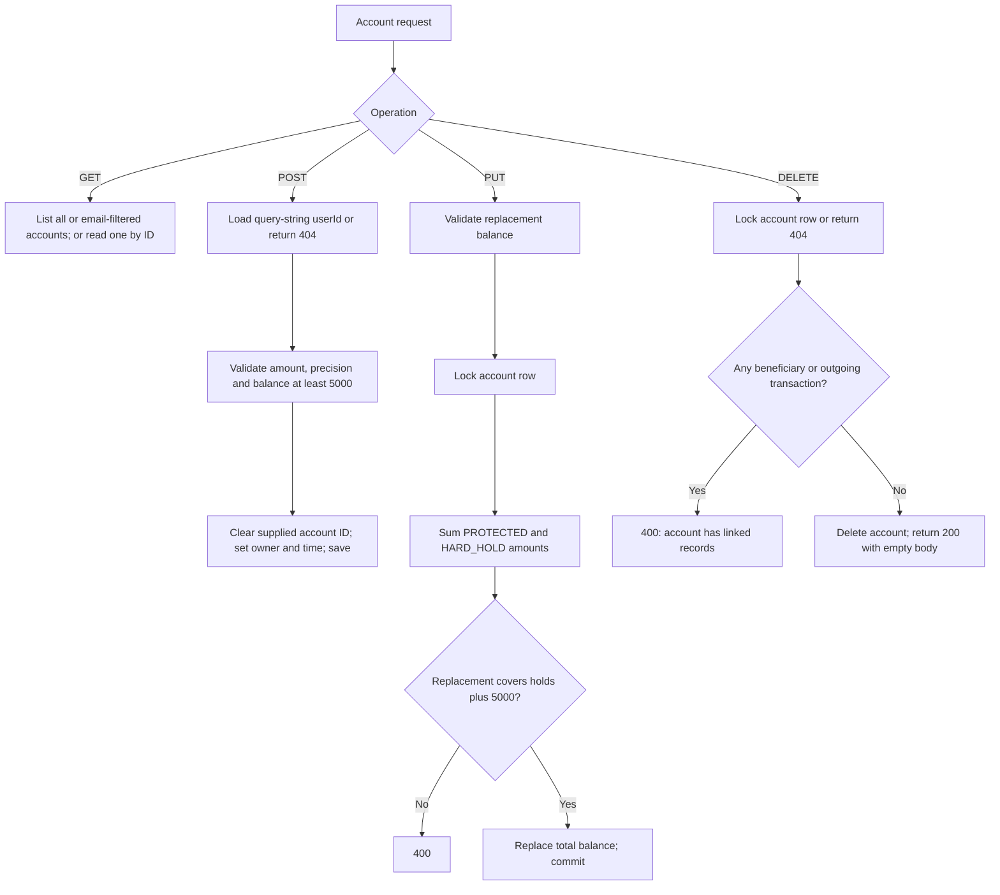

For one account:

```text
reserved = sum(amount for transactions in PROTECTED or HARD_HOLD)
spendable = stored balance - reserved - 5000.00
new payment is allowed only when amount <= spendable
replacement balance must be >= reserved + 5000.00
```

The reservation is derived from transaction rows; there is no separate reservation table or debit at protection entry. Even an expired PROTECTED row remains reserved until the scheduler actually settles it. A cancelled payment drops out of the reservation sum. No refund is written because cancellation did not reverse a debit.

For example, with ₹5,00,000 stored balance, a ₹25,000 protected payment leaves the stored balance at ₹5,00,000 and spendable funds at ₹4,70,000. Cancelling it restores spendable funds to ₹4,95,000 without changing stored balance. If it settles instead, stored balance becomes ₹4,75,000 and spendable funds remain ₹4,70,000.

Account deletion is blocked by **any** linked beneficiary, including INACTIVE ones, or any outgoing transaction, including terminal ones. There is no beneficiary-delete or transaction-delete API to remove these guards. Use a separate unused user/account when demonstrating successful deletion.

Source: [UserServiceImpl](../src/main/java/com/ofss/services/UserServiceImpl.java), [AccountServiceImpl](../src/main/java/com/ofss/services/AccountServiceImpl.java).

## 6. Beneficiary flow

### Diagram 6 — Add, list, activate, deactivate

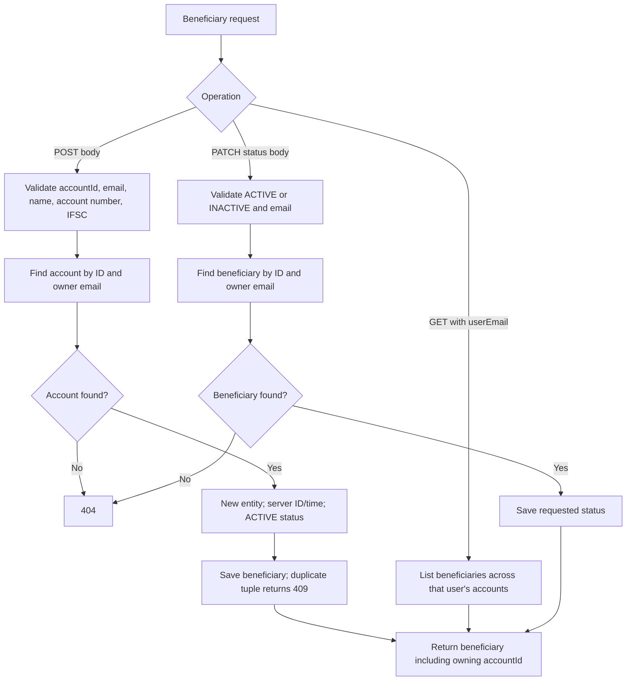

Listing includes both ACTIVE and INACTIVE beneficiaries. Use each returned `accountId` to select beneficiaries for the correct sending account. Matching the user email alone is not enough for a transfer: initiation also requires beneficiary ownership by the selected source account.

Source: [BeneficiaryServiceImpl](../src/main/java/com/ofss/services/BeneficiaryServiceImpl.java), [Beneficiary](../src/main/java/com/ofss/beans/Beneficiary.java).

## 7. Payment initiation, risk, and state

### Diagram 7 — Initiation and idempotency

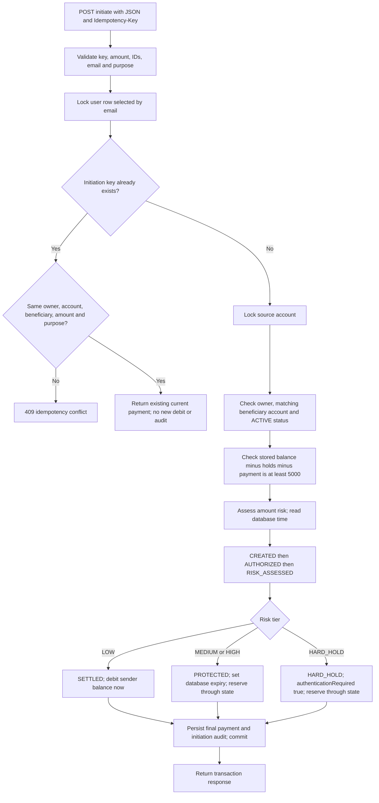

Matching amount retries compare decimal value, so numerically equivalent two-decimal inputs match. Omitted/empty/null purpose values normalize to null before comparison. Reusing a key for a different payment returns 409. Same-user initiation/cancellation operations wait on the user lock; database uniqueness also protects key collisions across different users.

An initiation error rolls back that attempt. Risk evaluation does not catch an error and silently turn it into LOW: the operation fails before persisting the new payment. Initial intermediate states are validated in Java, but the first saved transaction row contains its resulting SETTLED, PROTECTED, or HARD_HOLD state. The audit is not a row-by-row log of each initial intermediate state.

### Exact amount boundaries

| Amount accepted by current API | Tier | Initial persisted state | Protection seconds | Authentication required |
|---|---|---|---:|---|
| ₹0.01 through ₹10,000.00 | LOW | SETTLED | 0 | false |
| Greater than ₹10,000.00 through ₹50,000.00 | MEDIUM | PROTECTED | 10 | false |
| Greater than ₹50,000.00 through ₹1,00,000.00 | HIGH | PROTECTED | 60 | false |
| Greater than ₹1,00,000.00 | HARD_HOLD | HARD_HOLD | 0 | true |

The API accepts any positive value with at most two fractional digits and sixteen integer digits; its smallest accepted transfer is **₹0.01**, not ₹1. The boundaries are continuous: ₹10,000.01 is MEDIUM, ₹50,000.01 is HIGH, and ₹1,00,000.01 is HARD_HOLD. All tiers still require enough spendable balance.

The stored reasons are currently these fixed strings:

- `Amount is within the Low-risk range.`
- `Amount is within the Medium-risk range.`
- `Amount is within the High-risk range.`
- `Amount is above the High-risk limit and requires authentication.`

### Diagram 8 — Current state machine

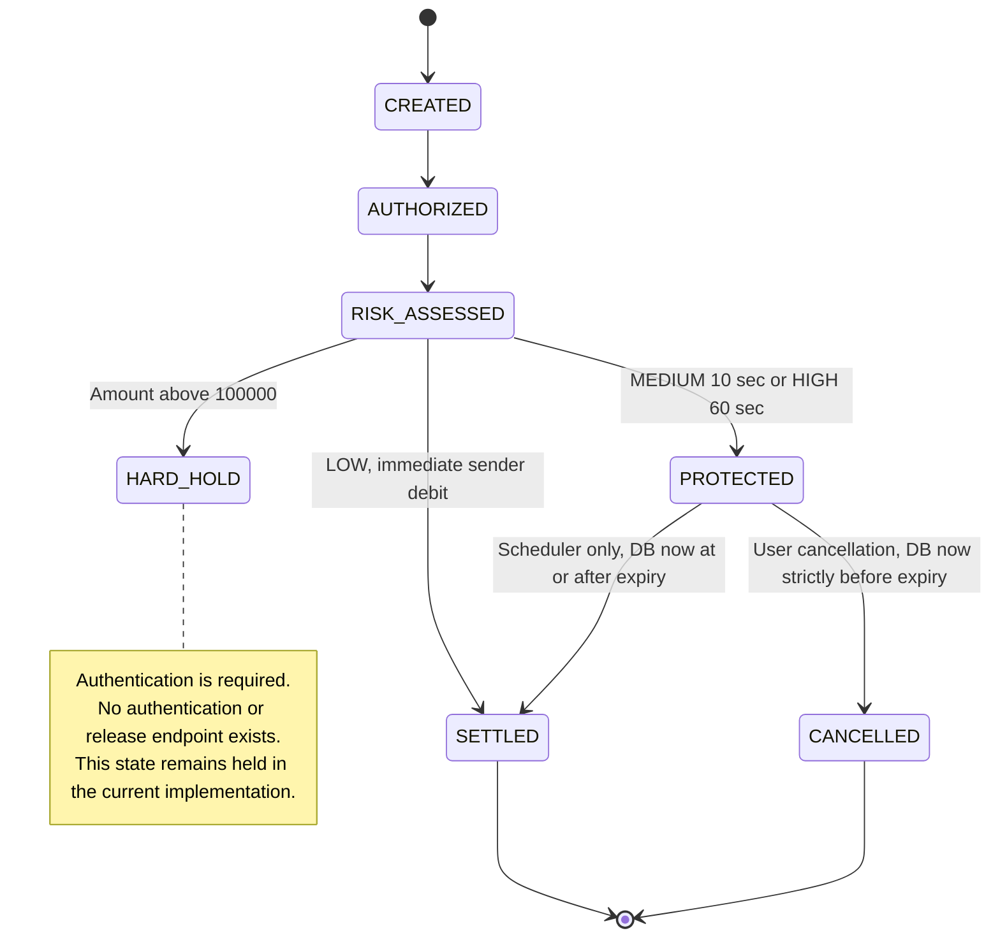

HARD_HOLD has **no outgoing implemented transition**. It also cannot be cancelled through the existing cancellation endpoint. The product specification describes future authentication; the diagram intentionally represents the current code. Settled/cancelled payments cannot be changed to another state. A replay of a completed cancellation is an idempotent read of its result, not a second transition.

Source: [AmountRiskEngine](../src/main/java/com/ofss/services/AmountRiskEngine.java), [TransactionServiceImpl](../src/main/java/com/ofss/services/TransactionServiceImpl.java), [TransactionState](../src/main/java/com/ofss/beans/TransactionState.java).

## 8. Cancellation and automatic settlement

### Diagram 9 — Cancellation, deadline check, and replay

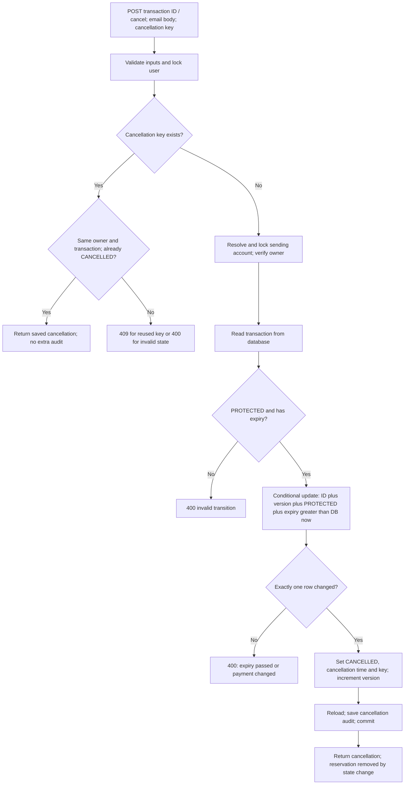

Cancellation is allowed only when database time is **strictly earlier** than expiry. At equality, cancellation is rejected even if the scheduler has not processed the row yet. Time spent waiting for locks counts toward the window because the decisive deadline comparison occurs inside the database update.

A repeat with the original successful cancellation key returns 200 after the window has expired, since it returns the saved result. A new key against an already cancelled payment fails the state check with 400. Reusing a successful cancellation key for another transaction produces 409.

### Diagram 10 — Scheduled settlement and per-payment isolation

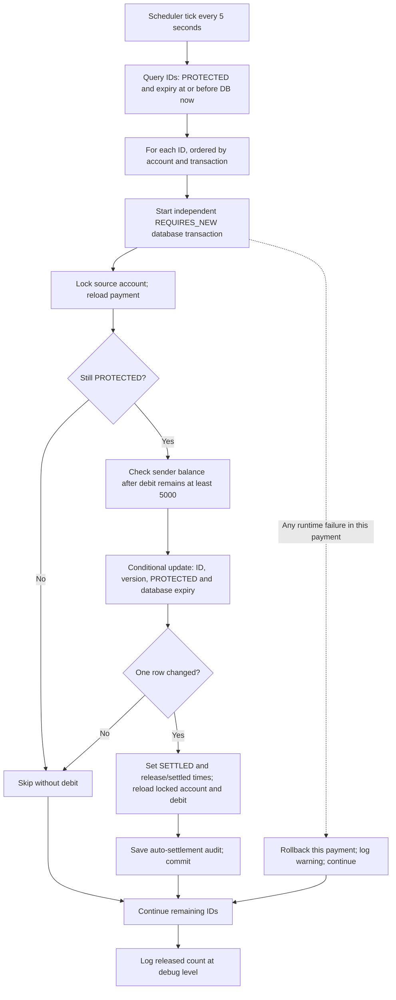

State update, sender debit, and settlement audit commit together. If any fails, that payment's database transaction rolls back, leaving it available for retry where still eligible. One failed payment does not roll back earlier successful payments in the same scan.

Settlement occurs on an eligible scheduler pass, rather than exactly at the last millisecond of the protection window. Usually this adds up to roughly one 5-second interval; lock contention, processing, or a failed pass can add more. Restarting the app does not discard holds: the next scan queries expired rows from the database. HARD_HOLD rows are never selected by this job.

Source: [TransactionScheduler](../src/main/java/com/ofss/services/TransactionScheduler.java), [TransactionDao](../src/main/java/com/ofss/repository/TransactionDao.java), [TransactionServiceImpl](../src/main/java/com/ofss/services/TransactionServiceImpl.java).

## 9. Reads, concurrent operations, and audit

### Diagram 11 — Status polling and filtered history

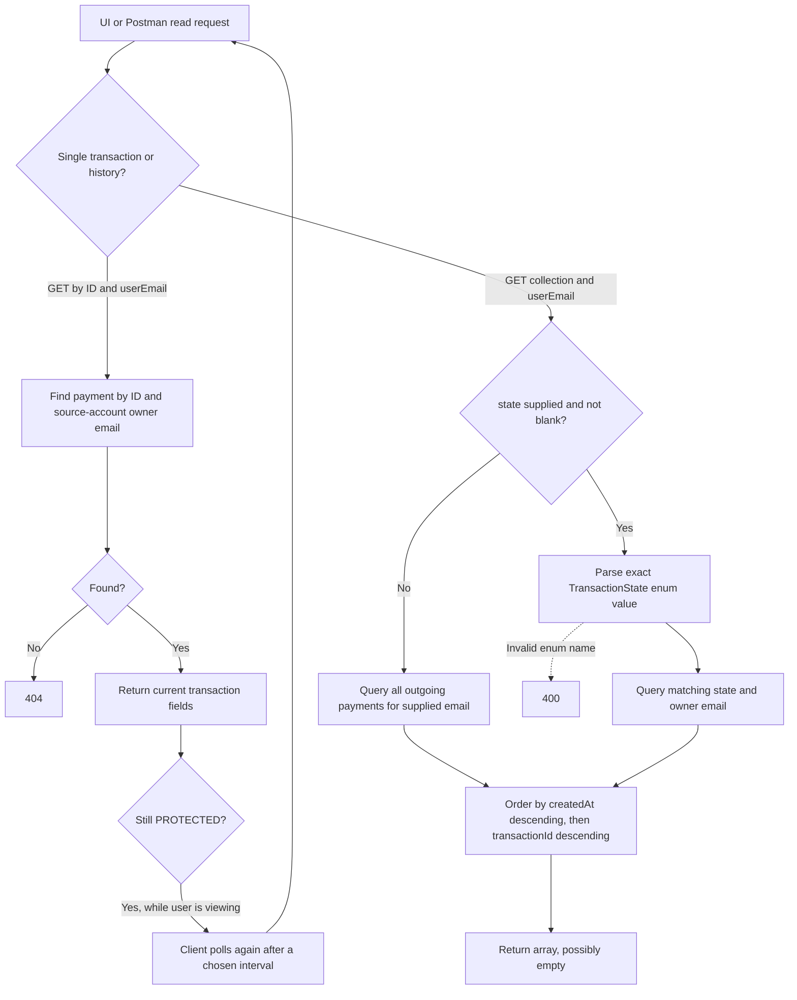

Accepted state names are `CREATED`, `AUTHORIZED`, `RISK_ASSESSED`, `PROTECTED`, `HARD_HOLD`, `CANCELLED`, and `SETTLED`, with exact uppercase spelling. The first three normally do not appear in history because initiation saves the resulting state in one transaction. A valid but unmatched state returns an empty list. An absent or blank state means no state filter.

The API does not offer pagination, date ranges, a beneficiary filter, or a source-account filter on transaction history. History includes outgoing payments across all accounts belonging to the supplied email. Response `fromAccountId` allows the UI to distinguish them. Polling is the implemented update mechanism; there are no WebSocket events.

### Diagram 12 — Locks, conditional transitions, and atomic audit

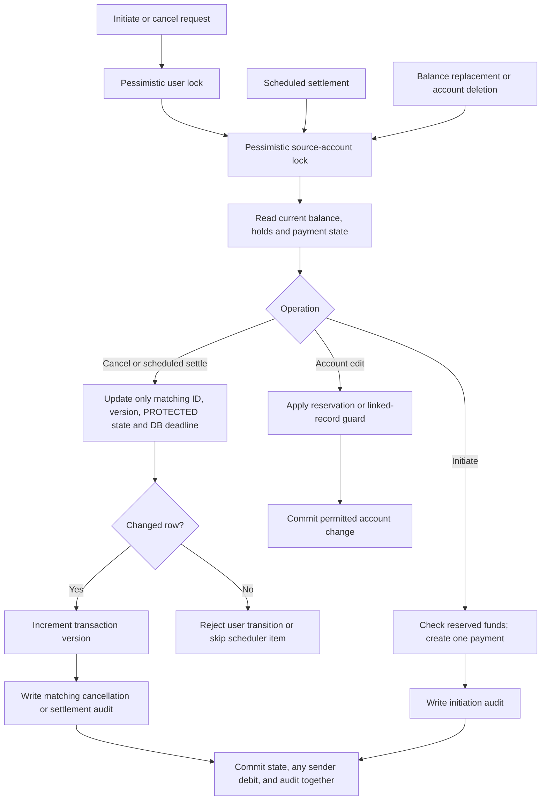

The user lock orders same-user initiation and cancellation requests before they acquire an account lock. The scheduler and account updates share the account lock, so the reservation and debit checks use current account data. The database conditional updates add state/version/deadline checks as the final safeguard for the cancellation-versus-expiry race. Bulk updates clear the JPA persistence context; the service reloads the saved transaction and, for settlement, the still-locked account before returning or writing dependent data.

| Audit action | Old state | New state | Written when |
|---|---|---|---|
| `TRANSACTION_INITIATED` | null | SETTLED, PROTECTED, or HARD_HOLD | A new initiation succeeds. |
| `TRANSACTION_CANCELLED` | PROTECTED | CANCELLED | The cancellation conditional update succeeds. |
| `TRANSACTION_AUTO_SETTLED` | PROTECTED | SETTLED | Scheduled settlement and sender debit succeed. |

Every row also stores its transaction ID, user ID, and creation timestamp. Successful idempotent replays do not add another audit row. User/profile/account/beneficiary edits do not currently create these transaction audit events.

Source: [TransactionDao](../src/main/java/com/ofss/repository/TransactionDao.java), [AccountDao](../src/main/java/com/ofss/repository/AccountDao.java), [UserDao](../src/main/java/com/ofss/repository/UserDao.java), [AuditLog](../src/main/java/com/ofss/beans/AuditLog.java).

## 10. Validation and error contract

| Input | Current rule |
|---|---|
| User name | Required, not blank, at most 100 characters. |
| User email / body `userEmail` | Required, email format, at most 150 characters. User email must be unique. |
| User phone | Required; exactly ten digits, starting with 6, 7, 8, or 9; unique. |
| Password on creation | Required and not blank; at most 72 characters and 72 UTF-8 bytes. No additional minimum length policy. |
| Password on update | Optional; a supplied non-null password must satisfy the same nonblank and maximum rules. |
| Account balance | Required; at least ₹5,000; representable with sixteen integer digits and two fractional digits. Replacement must also cover reservations. |
| Body account/beneficiary IDs | Required and positive for beneficiary creation/payment initiation. |
| Beneficiary name | Required, not blank, at most 100 characters. |
| Beneficiary bank account number | Required string of 9 through 30 digits; leading zeroes are retained as string data. |
| IFSC | Required; matches `[A-Z]{4}0[A-Z0-9]{6}`; exactly eleven uppercase-format characters. |
| Beneficiary status | Exactly `ACTIVE` or `INACTIVE`. |
| Payment amount | Required, positive, at most sixteen integer digits and two fractional digits. No rounding of nonzero extra decimal places. |
| Payment purpose | Optional; at most 255 characters. |
| Idempotency key | Required header for initiate/cancel; nonblank; at most 100 characters. |
| Query parameters | Required presence/type where declared by controllers; GET emails do not use the body DTO's email-format validation. |

Account balance is validated in the service, which normalizes exact values to two decimals without rounding. Payment DTO validation also rejects a representation with more than two fractional digits before the service runs. Phone/account/IFSC checks validate format only; they do not call a bank, verify an account's existence, or verify ownership of an email or phone.

| Status | Typical causes |
|---|---|
| 400 | Missing/invalid JSON fields; malformed JSON; missing required parameter/header; wrong parameter type; invalid amount or balance; insufficient spendable funds; inactive or mismatched-account beneficiary; invalid state; expired cancellation; deletion guard. |
| 404 | Requested user/account/transaction missing, or an owner-filtered account/beneficiary/transaction does not match the supplied email. |
| 409 | Duplicate email/phone/beneficiary tuple; idempotency key conflict; database integrity conflict; translated concurrency or optimistic-lock failure. |
| 500 | Unexpected server failures; method return-value validation failure. Not every infrastructure failure is converted to a business 400/409. |

Typical business error:

```json
{
  "message": "Only an active protected transaction can be cancelled"
}
```

Body-validation response:

```json
{
  "message": "Validation failed",
  "errors": {
    "amount": "must be greater than 0"
  }
}
```

Default validator message wording can depend on locale; clients should primarily use the HTTP status and `errors` field names. Password validation errors use the public field name `password`. Validation responses do not include the rejected password or other submitted field values. Database-conflict responses use a generic message without raw SQL.

Source: [request DTOs and entities](../src/main/java/com/ofss/beans), [GlobalExceptionHandler](../src/main/java/com/ofss/excp/GlobalExceptionHandler.java).

## 11. Current boundaries and UI implications

- No login, JWT generation, session identity, password reset flow, verified email/phone flow, or authenticated authorization is implemented. Password hashing is storage behavior, not an authentication flow.
- Payment rail selection is not a request field. Transfers are simulated outgoing transaction records with a sender debit at settlement; the backend does not credit a beneficiary account or contact a real bank.
- HARD_HOLD reserves funds indefinitely in the current code. There is no authentication/release/cancel route for that state; present it as a held payment, not a working OTP workflow.
- Stored account balance, reserved funds, and spendable funds are distinct concepts. Account responses currently return stored balance only; the reservation sum is internal to the services.
- Existing protected payments remain subject to their original hold even if the beneficiary is subsequently deactivated.
- No beneficiary details-update/delete route, transaction-delete route, audit-read route, pagination, configurable risk ranges, or advanced search is implemented.
- No corporate approvals, maker-checker workflow, ML risk model, WebSocket push, dispute handling, or real bank settlement is implemented.
- There is no explicit CORS configuration in the current source. A frontend on a different browser origin needs an appropriate development proxy or a deliberate later CORS change; Postman requests are not browser-origin requests.
- Lists are not uniformly user-scoped: `/api/users` lists all users, `/accounts` lists all accounts when email is absent, and user/account-by-ID writes do not require a logged-in owner. The intended current UI is a simulator.
- Timestamps have no timezone offsets. Client countdowns are an aid to display; the database decides whether a protected payment can still be cancelled.

These are current implementation boundaries, not claims that the older specification's future features have been completed. The [Postman testing guide](SafePay_Postman_Testing.md) provides runnable examples and a controlled end-to-end test order; the [collection](../postman/SafePay.postman_collection.json) and [environment](../postman/SafePay.local.postman_environment.json) provide importable requests and variables.
