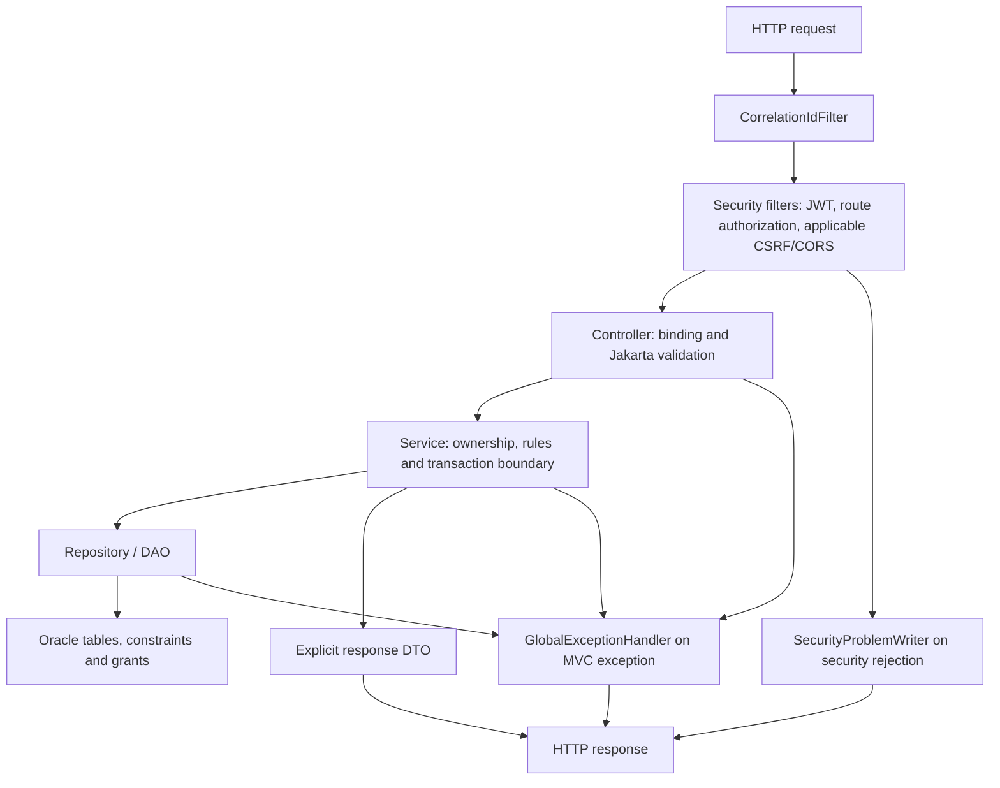

# SafePay — Master Backend Understanding Guide

**Increment 1 · Foundation, coverage index and Phase 2.1 · 19 September 2026**

**Reading checkpoint:** Phase 2.1 is documented for review. Chapters 2.2–2.12 are indexed, not yet written. Backend implementation is already complete for the approved scope; an unwritten chapter does not mean unimplemented code.

**Verified implementation baseline:** the user supplied successful 31-test regression, 178-test affected-group and **1148-test full-suite** results, with zero failures, errors or skips. V13 migration and application startup were previously confirmed by the user. These are recorded historical results, not executions performed while writing this guide. Manual API acceptance remains a separate activity.

**Companion:** [Phase 2.1 API-test guide](<C:/Users/Aditya Rao/Downloads/Training/Project/SafePay/Documentation for SafePay/API Test Guides/SafePay_Phase_2_1_API_Test_Guide.md>).

## Navigation

1. [How to use this book](#how-to-use-this-book)
2. [Authority and source ledger](#authority-and-source-ledger)
3. [The system you are learning](#the-system-you-are-learning)
4. [Chapter map and incremental delivery](#chapter-map-and-incremental-delivery)
5. [Phase 2.1 — Shared backend foundations](#phase-21--shared-backend-foundations)
6. [Production source coverage index](#production-source-coverage-index)
7. [Review checkpoint](#review-checkpoint)

## How to use this book

Read the business reason first, then follow the named method through the source. An annotation is not an explanation by itself: each chapter explains what that annotation does in this application, what SQL or HTTP contract it participates in, and where its responsibility ends.

The teaching unit is a production class, interface, enum or record. Its home chapter covers fields and types, constructors/factories, methods including private helpers, normalization, validation, mutations, callers, downstream dependencies, persistence and constraints where applicable. Nested types belong to the same source-file entry and receive their own explanation when that chapter is written. Java-generated record accessors/equality/hash/toString are identified rather than described as handwritten methods.

Test classes receive **short functionality summaries only**. A surprising case is explained where it helps understand a contract. This book is not a test-framework or fixture-maintenance manual.

The companion API guide is produced **with each chapter**. It holds the executable manual requests, expected responses and checks. It does not claim that a request was run simply because its expected behavior follows from source.

### Reading conventions

| Label | Meaning |
|---|---|
| Current behavior | Supported by the inspected production source/configuration/schema |
| Historical foundation | Earlier approved scope or recorded implementation progression |
| Later addition | Behavior incorporated after the initial logical phase |
| No direct mapping | This type is not a JPA entity and declares no table/column mapping |
| Cross-reference | Explained fully in another chapter; only its present connection is explained here |
| Manual verification pending | A documented request has not been executed during guide creation |

“Introduced in Phase 2.1” is used for the foundation responsibilities confirmed in the plan/context. It is not a claim that every line of today's shared classes existed on that first day. Current source establishes behavior; earlier chats establish chronology only where their evidence is explicit.

A passing suite is useful regression evidence. It is not proof of every possible race, deployment condition, security property or future change. This guide will not substitute a guessed guarantee for a verified contract.

## Authority and source ledger

The latest explicit user decisions govern scope and approvals. Existing approved decisions remain effective unless specifically replaced. Current code and migrations establish what actually runs; a difference between them and an approved requirement must be reported, not silently reconciled by editing either side.

| Source | Use in this guide |
|---|---|
| [UPDATED_Decision_Register.md](<C:/Users/Aditya Rao/Downloads/Training/Project/SafePay/UPDATED_Decision_Register.md>) | Active V1 business/security contracts; supersedes original/reconciled register where amended |
| [UPDATED_implementation_plan.md](<C:/Users/Aditya Rao/Downloads/Training/Project/SafePay/UPDATED_implementation_plan.md>) | Logical Phase 2.1–2.12 sequence and original exit gates |
| [Change-request implementation guide](<C:/Users/Aditya Rao/Downloads/Training/Project/SafePay/change_request_implementation_guide.md>) | Approved later account, user, category, review, audit and operations changes; locked through Phase 8 |
| [Master guide contract](<C:/Users/Aditya Rao/Downloads/Training/Project/SafePay/dbsetup_cum_backend_master_guide_contract.md>) | Class-level explanation and separate API-guide requirements, amended by the latest delivery/test-detail instructions |
| [Backend continuation context](<C:/Users/Aditya Rao/Downloads/Training/Project/SafePay/SafePay_Backend_DB_Context.md>) | Verified checkpoints and chronology, not a replacement for source |
| [Operative implementation contract](<C:/Users/Aditya Rao/Downloads/Training/Project/SafePay/Contract for Codex Agent to Adhere to for Safepay.txt>) | Scoped writes, verification ownership and change boundaries |
| [PRD](<C:/Users/Aditya Rao/Downloads/Training/Project/SafePay/SafePay_PRD.md>) | Background only where not superseded by approved decisions |
| Current Java, application.properties, pom.xml and SQL | Exact implementation evidence; linked throughout |
| Existing phase summaries, seed and launch guides | Learning/history support; their older version/count instructions require the current baseline overlay below |

The authorized historical tasks “SafePay - DB Design” and “Safepay - DB to Backend shift” were consulted at their latest handoff/progression entries. This does **not** claim a fresh exhaustive reread of every historical turn. The current backend-development conversation supplies the subsequent approvals and results. Older implementation instructions are not re-executed while documenting.

### Baseline corrections that apply throughout

- **1148** is the current user-confirmed suite result, superseding 866/870/918/1002/1054 and intermediate expectations.
- SQL coverage is **V1–V13 plus repeatable grants**, not only V1–V11.
- V12 remains in `db/showcase`; V1–V11 and V13 are in `db/migration`. Existing showcase deployments retain both locations and target 13.
- Applied V1–V13 are immutable. This documentation pass authorizes no migration, application startup, dependency installation or Maven execution.
- The original plan's “profile-based configuration” is represented in current source by one environment-driven `application.properties`. No separate application-dev/test profile files exist under the inspected main resources.
- The new SYSTEM_ADMIN operations-health feature was removed from change-request scope. Existing framework `/actuator/health` is a different facility and still exists.
- Oracle vector/semantic-search integration was discarded entirely, including its pending-list entry.
- OpenAPI remains pending before frontend integration. The master/API guides do not constitute an implemented OpenAPI delivery.
- Broader team comparison, frontend integration and presentation work remain outside this increment.

## The system you are learning

SafePay is a **simulated pre-settlement payment-control layer**. It records a proposed payment, evaluates the approved amount policy, applies protection or verification, and settles through its internal ledger when permitted. It does not reverse posted interbank payments or integrate live payment rails.

| Amount | Current V1 route | What the reader must distinguish |
|---:|---|---|
| ₹1.00–₹5,000.00 | LOW, immediate release path | Release eligibility and actual settlement execution are separate responsibilities |
| ₹5,000.01–₹25,000.00 | MEDIUM, 10-second protection | Server timing and state decide whether Undo is still legal |
| ₹25,000.01–₹1,00,000.00 | HIGH, 60-second protection | Browser countdown is advisory |
| Above ₹1,00,000.00 | VERY_HIGH, OTP and Risk Officer review | No automatic expiry; category is required for new payment requests |

Category priority helps order the Risk Officer's work. It does not replace the amount risk policy. Legacy transactions retain NULL category and their original purpose. New high-value OTHERS payments require the approved short purpose. These contracts belong in Chapters 2.6 and 2.11.

The four authorities are `CUSTOMER`, `SYSTEM_ADMIN`, `RISK_OFFICER`, and `AUDITOR`. “Admin” may describe the three staff personas collectively; it is not a fifth Java/SQL authority, and one staff role does not automatically grant the others.

### Architecture in one request



The diagram shows responsibility, not an assertion that every request reaches every box. A malformed body can stop before a service runs; a missing JWT can stop even earlier. An exception translated after a service call does not itself perform rollback: the transaction boundary owns that decision.

### Package vocabulary

| Package | Responsibility | Example |
|---|---|---|
| `beans` | Domain entities and enums; many, but not all, are persisted | `Account`, `TransactionDb`, `PaymentCategory` |
| `repository` | Persistence/query interfaces and reporting reads | `AccountDao`, `ReportingReadRepository` |
| `services` | Business orchestration, invariants and reusable contracts | `AccountFundsServiceImpl` |
| `controller` | HTTP binding and explicit API responses | `TransactionController` |
| `dto` | Request/response shapes, not database entities | `CreateTransactionRequest` |
| `security` | Authentication, authorization, token/cookie/browser controls | `SecurityConfig` |
| `scheduler` | Background discovery and invocation | `ProtectedTransactionScheduler` |
| `common` / `common.api` | Shared money, time, masking and transport infrastructure | `MoneyUtility`, `PagedResponse` |
| `excp` | Meaningful exceptions and HTTP translation | `GlobalExceptionHandler` |

### Compact glossary

| Concept | Topic | Plain-language meaning in SafePay |
|---|---|---|
| Entity | JPA/Oracle mapping | A Java object tied to stored state, unlike a response projection |
| DTO / record | Java + HTTP | A deliberate set of fields crossing an application/API boundary |
| Dependency injection | Spring | Spring supplies a class's collaborators through its constructor |
| Bean | Spring | An object managed by the application container |
| Transaction | Spring/Oracle | A unit whose database changes commit together or roll back under its rules |
| Reservation | Payments | Funds unavailable to another payment while still included in current balance |
| Idempotency | HTTP/business orchestration | Duplicate operation requests are recognized by an operation key and fingerprint |
| Correlation ID | Observability | A label connecting one request's response, logs and evidence |
| Masking | Data minimization | Hiding part of an identifier in a projection; neither hashing nor encryption |
| Optimistic version / pessimistic lock | JPA/concurrency | Different controls for competing changes; domain chapters identify the actual control |
| Migration / repeatable grant script | Flyway/Oracle | Versioned schema evolution versus a separately maintained repeatable privilege script |

## Chapter map and incremental delivery

Each row will be delivered as **master chapter + its companion API guide → user review stop**. Later additions are placed by responsibility, not by the date their endpoint was created.

| Chapter | Home responsibilities | Later work folded into that chapter | Current documentation state |
|---|---|---|---|
| 2.1 | Bootstrap/configuration, money/time, correlation, common DTOs, errors | Current masking/pagination and extended exception translations | Complete for review in this increment |
| 2.2 | Users/roles/authentication/authorization | Deferred SEC-A–SEC-K, profile and administrative user security, HTTP/STOMP security | Indexed; awaiting next approval |
| 2.3 | Accounts, balances, reserve/release/settle primitives | Customer account REST closure; SYSTEM_ADMIN account directory/detail | Indexed |
| 2.4 | Beneficiary ownership, destination validation and status | Current masked projections | Indexed |
| 2.5 | Amount policy, immutable risk evidence, policy snapshots | Explicit contrast with deferred multi-signal proposals | Indexed |
| 2.6 | Transaction creation, authorization, state and queries | Conditional category, customer history/search | Indexed |
| 2.7 | Idempotency identity, fingerprints and durable replay | Category fingerprint and strict validation/replay interaction | Indexed |
| 2.8 | Expiry, protected release and cancellation races | Current scheduler controls | Indexed |
| 2.9 | Ledger settlement, exceptions and retry processing | Auditor ledger/reconciliation/exception concepts, reporting cross-references | Indexed |
| 2.10 | OTP lifecycle and development email | Fixed-recipient routing and re-verification connections | Indexed |
| 2.11 | Risk Officer review and decisions | Category ordering/filtering, notes, auditor read-only review connection | Indexed |
| 2.12 | Audit evidence, notifications and realtime | Shared auditor evidence APIs, SYSTEM_ADMIN statistics/failures, reporting repository | Indexed |

Shared auditor DTO/controller/service sources have their detailed home in 2.12; earlier domain chapters will still explain the corresponding financial or review contract. Security-sensitive parts of realtime transport are covered in logical 2.2 and referenced from 2.12. This is a documentation arrangement, not a request to move code.

### SQL navigation map

All names below refer to the current source resources, not a new database inspection.

| Resource | Primary subject and chapter connection |
|---|---|
| V1 security_and_users | Identity, roles, sessions → 2.2 |
| V2 accounts_and_beneficiaries | Account/funds and beneficiary storage → 2.3/2.4 |
| V3 risk_policy | Policy model → 2.5 |
| V4 transactions_and_idempotency | Payment state, evidence, replay → 2.5/2.6/2.7 |
| V5 otp_and_risk_approvals | OTP/review storage before later vocabulary reconciliation → 2.10/2.11 |
| V6 ledger_and_exceptions | Settlement and operational exceptions → 2.9 |
| V7 audit_and_notifications | Evidence and notification lifecycle → 2.12 |
| V8 analytical_and_reconciliation_views | Read models/reconciliation → 2.9/2.12 |
| V9 phase_1_9_vocabulary_reconciliation | Canonical vocabulary; read with original definitions |
| V10 phase_1_9_integrity_hardening | Additional cross-row/composite integrity and supporting indexes; read with affected definitions |
| V11 canonical_v1_reference_data | Approved reference data |
| V12 safepay_v1_showcase_seed | Synthetic personas/scenarios, not a reason to rewrite schema |
| V13 payment_category | Nullable historical category and conditional constraints → 2.6/2.11 |
| R__safepay_app_grants | Restricted runtime permissions, distinct from privileged migration execution |

## Phase 2.1 — Shared backend foundations

### 2.1.1 Why this phase exists

Before a payment workflow can be trusted, all its modules need the same basic vocabulary: what counts as money, how time is obtained, how IDs are presented, how errors are reported and how one request can be traced. Otherwise two correct-looking modules can disagree at their boundary.

Example: a frontend submits ₹5000.001. Rounding it down would turn an invalid request into a different financial request. The foundation therefore rejects excess scale rather than silently adjusting it. A later risk engine can then compare exact accepted amounts.

The phase has **no independent SafePay business controller** and introduces **no dedicated database table**. It is exercised by legitimate later account, authentication, beneficiary and transaction APIs.

### 2.1.2 Files fully explained in this chapter

All source paths below are relative to `backend/src/main/java/com/ofss`; the coverage index provides a clickable absolute link for each.

| File | Responsibility |
|---|---|
| `SafePayApplication.java` | Application entry point and component-scan root |
| `common/ClockConfiguration.java` | Injectable UTC JVM clock |
| `common/CorrelationIdFilter.java` | Request/response/log correlation |
| `common/MoneyUtility.java` | Exact transaction-amount validation |
| `common/SensitiveDataMasker.java` | Safe partial identifier projections |
| `common/api/FieldValidationError.java` | One validation-error item |
| `common/api/PagedResponse.java` | Stable paginated response shape |
| `excp/BusinessRuleException.java` | Validly shaped request rejected by business rules |
| `excp/DuplicateResourceExcp.java` | Stable duplicate/conflict representation |
| `excp/ResourceNotFoundExcp.java` | Stable missing/hidden resource representation |
| `excp/GlobalExceptionHandler.java` | Current centralized MVC exception translation |

Also explained: [pom.xml](<C:/Users/Aditya Rao/Downloads/Training/Project/SafePay/backend/pom.xml>) and the foundation settings in [application.properties](<C:/Users/Aditya Rao/Downloads/Training/Project/SafePay/backend/src/main/resources/application.properties>). Specialized OTP, JWT, scheduler, WebSocket and idempotency settings retain their domain chapters.

### 2.1.3 Startup, dependencies and configuration

#### SafePayApplication

`@SpringBootApplication` marks the bootstrap class in `com.ofss`. Its package location lets Spring discover the project's subpackages through the default component scan.

- **Declared fields:** none.
- **Constructor:** no explicit constructor; Java supplies a public no-argument constructor.
- **Method:** `public static void main(String[] args)` calls `SpringApplication.run(SafePayApplication.class, args)`.
- **Mutation:** no domain mutation in this method; starting the application activates configured infrastructure and potentially enabled workers.
- **SQL mapping:** none. Startup indirectly invokes configured Flyway and Hibernate behavior; the class is not a migration or repository.
- **Dependencies/consumers:** Java launches it; the entire Spring application depends on successful bootstrap.

Do not confuse “there is no SQL in main” with “starting main is read-only.” Flyway is enabled and background features have their own enable flags. This is why startup remains a user-controlled operation.

#### pom.xml as the dependency contract

The current project uses `com.ofss:safepay:0.0.1-SNAPSHOT`, Java **21**, and Spring Boot parent **3.5.16**. These are source declarations, not a fresh environment probe.

| Declared dependency group | Why it is present |
|---|---|
| web | MVC controllers, JSON and HTTP responses |
| validation | Jakarta constraint evaluation on requests |
| data-jpa | Repository/entity persistence and transaction integration |
| ojdbc11, runtime scope | Oracle JDBC driver |
| flyway-core + flyway-database-oracle | Versioned Oracle migration support |
| security + oauth2-resource-server | HTTP security and JWT/Jose support, expanded in 2.2 |
| websocket + security-messaging | STOMP transport/security, 2.2/2.12 |
| mail | Development OTP email, 2.10 |
| actuator | Existing framework health infrastructure |
| devtools, optional runtime | Development restart support |
| lombok, optional | Available boilerplate support; do not assume every class uses it |
| starter-test + security-test, test scope | Automated verification support; no runtime endpoint implied |

The Boot plugin excludes Lombok from the packaged application. Surefire's configured system properties disable the protection scheduler, notification dispatcher and OTP email during automated tests. This does not assert that every background feature is disabled by that block; settlement has its own configuration. No dependency was added for this guide.

#### Current configuration, setting by setting

| Setting | Current value/source | Meaning |
|---|---|---|
| `spring.application.name` | `safepay` | Application identity |
| datasource URL/user/password | `SAFEPAY_DB_URL`, `SAFEPAY_DB_APP_USERNAME`, `SAFEPAY_DB_APP_PASSWORD` | Restricted runtime connection |
| datasource driver | `oracle.jdbc.OracleDriver` | Oracle JDBC |
| `spring.jpa.hibernate.ddl-auto` | `validate` | Check mappings; do not create/update tables through Hibernate |
| `spring.jpa.open-in-view` | `false` | DTO construction must not rely on keeping persistence access open throughout view rendering |
| Hibernate default schema | `SAFEPAY_OWNER` | Object namespace; does not change the login into owner credentials |
| Hibernate JDBC time zone | `UTC` | JDBC timestamp handling preference |
| `spring.jpa.show-sql` | `false` | Suppresses this SQL-printing facility; not a universal logging guarantee |
| Flyway enabled | `true` | Startup may apply eligible migrations |
| Flyway URL | `SAFEPAY_DB_URL` | Same configured database target |
| Flyway user/password | owner environment variables | Privileged schema evolution, separate from runtime |
| Flyway default schema / schemas | `SAFEPAY_OWNER` | History and managed schema target |
| Flyway locations in source | `classpath:db/migration` | Showcase location is an explicit deployment override |
| clean-disabled | `true` | Disables Flyway clean |
| baseline-on-migrate / out-of-order | `false` / `false` | No automatic baseline or out-of-order migration acceptance |
| validate-on-migrate / validate-migration-naming | `true` / `true` | Validation/naming safeguards |
| health show-details | `never` | Do not expose detailed database health through that endpoint |

For the already migrated showcase baseline, the user's environment retains `SPRING_FLYWAY_LOCATIONS=classpath:db/migration,classpath:db/showcase` and `SPRING_FLYWAY_TARGET=13`. This is a baseline reminder, **not an instruction to rerun migrations**. The source file itself does not hard-code target 13.

The remaining property families are deliberately explained in their own chapters: idempotency retention (2.7), protection (2.8), settlement (2.9), OTP/mail (2.10), notifications (2.12), JWT/login/refresh/browser origins (2.2).

**Concept — Spring configuration:** environment variables supply deployment-specific values without embedding credentials in source. A named Spring profile is a different mechanism. This checkout's environment-based setup should not be described as a completed multi-profile design merely because the original plan used that phrase.

### 2.1.4 ClockConfiguration and the two sources of time

`ClockConfiguration` has `@Configuration(proxyBeanMethods = false)`. It declares no fields and no explicit constructor. Its sole method, `@Bean public Clock applicationClock()`, returns `Clock.systemUTC()`. Spring injects that bean where a `Clock` constructor parameter is required.

**Business reason:** timing must come from controlled server infrastructure rather than a browser. Injecting a clock also separates “where now comes from” from “what this business method does with now.”

| Time source | Current use | Do not infer |
|---|---|---|
| Injected JVM `Clock` | Error timestamps; token issuance; registration/beneficiary timestamps; amount-risk assessment; idempotency timing; portions of transaction orchestration | That it is the Oracle clock or that all domain operations use it |
| Repository `SELECT SYSTIMESTAMP FROM DUAL` | Database-authoritative decisions in user/session, transaction, OTP/review, settlement and notification flows | That Oracle's returned textual offset is automatically UTC |
| Browser time | UI display/countdown only | Authority to release/cancel a payment |

Direct clock consumers found in current source: `GlobalExceptionHandler`, `SecurityProblemWriter`, `JwtAccessTokenService`, `AuthController`, `UserRegistrationServiceImpl`, `BeneficiaryServiceImpl`, `AmountRiskEngine`, `IdempotencyServiceImpl`, and `TransactionServiceImpl`.

There is **no DatabaseClockDao class** in this checkout. Database clock queries live in `UserDao.currentDatabaseTime()`, `TransactionDao.currentDatabaseTime()` and `AppNotificationDao.currentDatabaseTime()`; reporting queries also use `SYSTIMESTAMP` directly. They will be explained in their home chapters.

For example, `TransactionServiceImpl.currentUtcTime()` reads the injected clock, converts to UTC and truncates to microseconds. Its `currentDatabaseTime()` obtains the repository value, rejects null, converts to UTC and truncates to microseconds. These helpers have different sources even though the resulting Java datatype is `OffsetDateTime`.

**Fields/mutations/persistence:** ClockConfiguration has no stored domain fields, no setters, no entity mapping and no direct SQL. Its bean creation does not create a timer job. The clock supplies instants; services decide whether and where to store them.

**Concept — Java time:** `Instant` identifies a point on the timeline; `OffsetDateTime` also carries an offset. Changing `+05:30` to `Z` with `withOffsetSameInstant` preserves the instant. It is not subtraction of elapsed business time. `TIMESTAMP(6) WITH TIME ZONE` has microsecond fractional precision; inspect the caller's normalization rather than assuming every timestamp is transformed by one global serializer. [Java 21 Clock reference](https://docs.oracle.com/en/java/javase/21/docs/api/java.base/java/time/Clock.html).

### 2.1.5 MoneyUtility — reject a changed financial meaning

This final utility class has a private no-argument constructor, preventing normal instantiation. All behavior is static and stateless.

| Field | Java type/value | Purpose |
|---|---|---|
| `MONEY_PRECISION` | `public static final int = 18` | Total decimal precision used by money mappings |
| `MONEY_SCALE` | `public static final int = 2` | Accepted fractional places |
| `MINIMUM_TRANSACTION_AMOUNT` | `public static final BigDecimal = new BigDecimal("1.00")` | Minimum payment, not minimum account balance |

The only business method is `public static BigDecimal requireValidTransactionAmount(BigDecimal amount)`:

1. Reject null with `IllegalArgumentException("Amount is required")`.
2. Reject `amount.scale() > 2`. This happens **before** normalization.
3. Reject a numeric value below 1.00 using `compareTo`.
4. Normalize with `setScale(2, RoundingMode.UNNECESSARY)`.
5. Reject normalized precision above 18.
6. Return the normalized BigDecimal; the caller's immutable BigDecimal is not mutated.

| Input represented as BigDecimal | Outcome | Reason |
|---|---|---|
| `1` | `1.00` | Valid amount, normalized scale |
| `5000.01` | `5000.01` | Exact accepted value |
| `0.99`, zero, negative or null | Rejected | Minimum/required contract |
| `1.000` | Rejected | Scale is 3 even though the extra digit is zero |
| `5000.001` | Rejected | Would require loss of fractional information |
| `9999999999999999.99` | Accepted by this utility | 16 integral + 2 fractional digits |
| `10000000000000000.00` | Rejected | Normalized precision exceeds 18 |
| `1E+3` as a Java BigDecimal | `1000.00` | Negative scale can normalize exactly; utility acceptance does not define every HTTP binder's behavior |

The maximum representable amount is a **schema representation limit**, not a configurable payment-policy maximum and not proof of sufficient available funds.

**Consumers:** `AmountRiskEngine`, `RiskPolicyServiceImpl`, `TransactionDb`, `TransactionRiskFactor`, `LedgerPosting`, `CreateTransactionRequest`, `PaymentCategory`, and transaction fingerprint construction use this validation. `LedgerEntry` and transaction/posting mappings use its precision/scale constants. The Account entity has its own balance rules because **zero balance is legal**; a payment validator must not be reused indiscriminately for balances.

**SQL connection:** no mapping on the utility itself. V4's `PAYMENT_TRANSACTION.amount NUMBER(18,2) NOT NULL` and `CK_PAYMENT_TX_AMOUNT (amount >= 1.00)` are its direct business analogue. V2 account balances allow zero and impose additional reserve/current constraints. V6 ledger mappings are explained in 2.9. A SQL NUMBER scale is not a substitute for rejecting excess precision at the API boundary.

**Concept — Java decimals:** use `BigDecimal` and decimal literals constructed from strings for exact financial intent. `compareTo` compares numeric value, while `equals` also considers scale. Thus “1.0 and 1.00 have the same value” does not mean their representations are identical. [Java 21 BigDecimal reference](https://docs.oracle.com/en/java/javase/21/docs/api/java.base/java/math/BigDecimal.html).

### 2.1.6 CorrelationIdFilter — one request label across layers

This `@Component` extends `OncePerRequestFilter` and is ordered at `Ordered.HIGHEST_PRECEDENCE`. It supplies correlation before the business controller or security rejection needs to report an error.

| Field | Type/value | Use |
|---|---|---|
| `HEADER_NAME` | public static final String, `X-Correlation-ID` | Incoming/outgoing HTTP header |
| `MDC_KEY` | public static final String, `correlationId` | SLF4J logging-context key |
| `REQUEST_ATTRIBUTE` | public static final String, `safepay.correlationId` | In-process servlet request attribute |
| `SAFE_VALUE_PATTERN` | private static final Pattern, `[A-Za-z0-9._:-]{1,64}` | Allowed supplied identifier shape |

No explicit constructor exists; Java supplies a public no-argument constructor.

**Private `resolveCorrelationId(HttpServletRequest)`** reads the header, trims it, and returns it only when the entire candidate matches the pattern. Missing, blank, overlong or unsafe input is replaced with `UUID.randomUUID().toString()`. Invalid correlation input does not itself produce HTTP 400.

**Protected `doFilterInternal(request, response, filterChain)`**, returning void and declaring ServletException/IOException:

1. Resolve the identifier.
2. Set the request attribute.
3. Set the response header.
4. Put the value into MDC.
5. Invoke the remaining chain inside try.
6. Remove the MDC entry in finally, whether the chain succeeds or throws.

Its mutations are **request, response and thread logging context**, not account/payment state. The finally block prevents a pooled request thread from carrying this request's label into a later request.

MDC makes the value available to logging infrastructure; it does not by itself guarantee that every rendered log line prints it. The checked application.properties declares no custom MDC log pattern. GlobalExceptionHandler's unexpected-error log explicitly includes the correlation value in its message.

A valid client value can be reused. It is **not authenticated identity, a uniqueness constraint, an idempotency key, or permission to read logs**. The filter does not automatically persist an AUDIT_LOG row. Later controllers/services carry the identifier into evidence where their operation requires it. It also does not promise propagation into arbitrary asynchronous work; internal operations use their own context rules.

**Consumers:** authentication and transaction/review controllers obtain the request attribute; GlobalExceptionHandler and SecurityProblemWriter use it for `traceId`; evidence services receive it through their approved operation context. All later HTTP phases depend on it.

**SQL connection:** none declared by the filter. Its 64-character limit aligns with V4 `IDEMPOTENCY_RECORD.correlation_id` and V7 `AUDIT_LOG.correlation_id` / `APP_NOTIFICATION.correlation_id`. It neither creates those records nor invokes their triggers.

### 2.1.7 SensitiveDataMasker — projection, not mutation

This final class has private constant `ACCOUNT_VISIBLE_SUFFIX: int = 4`, a private no-argument constructor, and three public static methods returning String. It has no mutable state and no SQL/JPA mapping.

| Method | Validation/normalization | Output algorithm |
|---|---|---|
| `maskAccountNumber(String accountNumber)` | Null/blank rejected; no trimming is performed here | Length ≤4: all asterisks. Otherwise replace every character except the final four with `*` |
| `maskUpiId(String upiId)` | Null/blank rejected; trims input; verifies one `@` with nonempty parts | Invalid structure: mask entire trimmed value. Handle length ≤2: mask entire handle. Longer handle: preserve first/last character; preserve provider |
| `maskEmail(String email)` | Null/blank rejected; trims input; requires exactly one `@` and nonempty parts | Preserve first local-part character, then at least one `*`; preserve `@domain`. Malformed structure throws IllegalArgumentException |

Examples derived from the current methods:

| Call | Result |
|---|---|
| account `1234567890` | `******7890` |
| account `1234` | `****` |
| UPI `alice@bank` | `a***e@bank` |
| UPI `ab@bank` | `**@bank` |
| UPI `broken` | `******` |
| email `alice@example.com` | `a****@example.com` |
| email `a@example.com` | `a*@example.com` |

The short-email result intentionally has one star even for a one-character local part. UPI's malformed-input behavior is different from email's; do not generalize one into the other. These methods are not complete bank/UPI/email format validators.

**Consumers:** AccountSummaryResponse, AccountBalanceResponse, AdminAccountSummaryResponse, BeneficiaryResponse, TransactionResponse, RiskReviewSummaryResponse, AuditLedgerPostingResponse and OtpServiceImpl. Their home chapters explain which fields each role may see. The SYSTEM_ADMIN individual detail contract intentionally permits a full account number; masking is not applied universally to every response.

**Business role:** disclose only the approved projection while preserving original values in Oracle. It does not hash an account number, redact balances automatically, encrypt stored data or replace authorization.

### 2.1.8 Common response records

#### FieldValidationError

`public record FieldValidationError(String field, String message)` has two String components and no handwritten constructor, helper or validation. Java supplies the canonical constructor, component accessors, equals, hashCode and toString.

GlobalExceptionHandler creates these records from binding errors. The record itself does not establish that a field exists or that a message is safe; the caller supplies the values. No persistence, mutation, trigger or procedure is involved.

#### PagedResponse<T>

This generic record separates public JSON pagination from Spring Data's implementation-specific Page representation.

| Component | Type | Meaning |
|---|---|---|
| `items` | `List<T>` | Mapped response items for this page |
| `page` | `int` | Zero-based requested page index |
| `size` | `int` | Page capacity, not necessarily items.size |
| `totalElements` | `long` | Total matched elements |
| `totalPages` | `int` | Page count supplied by the source Page |
| `first` / `last` | `boolean` | Source Page boundary flags |

The compact canonical constructor replaces `items` with `List.copyOf(Objects.requireNonNull(items))`. This prevents later structural changes to the passed list from changing the response. It is a **shallow** copy: generic item objects are not recursively cloned.

It rejects page <0, size <1, totalElements <0 and totalPages <0. `List.copyOf` also rejects null items. It does not enforce size ≤100, recalculate flags, require a full page, or prove that totals agree with items. The service/query owns those contracts.

`public static <S,T> PagedResponse<T> from(Page<S> source, Function<? super S,T> mapper)`:

1. Requires source and mapper to be nonnull.
2. Maps each source item; a null mapper result is rejected.
3. Builds the record from the mapped items and all six source metadata values.

No setters, SQL, locks or entity relationships exist on this record.

**Consumers:** administrative account/user searches, transaction queries, risk-review queues, notification queries, audit queries/evidence and ReportingReadRepository. **Customer GET /api/v1/accounts still returns a plain List**, so expecting this wrapper there would be a test mistake.

**Concept — Java generics:** `S` is the repository item type; `T` is the safe output DTO. Mapping Account to AdminAccountSummaryResponse lets the service control disclosure while reusing the pagination envelope. It does not automatically serialize the Account entity.

### 2.1.9 The three shared business exceptions

All three extend `RuntimeException`, carry `private static final long serialVersionUID = 1L`, and store `private final String errorCode`. Each exposes `public String getErrorCode()`. Their inherited message is supplied to the RuntimeException constructor.

| Class | Constructors | Validation and result |
|---|---|---|
| `BusinessRuleException` | `(String errorCode, String message)` | Nonnull message; nonblank code; signals a business rejection |
| `ResourceNotFoundExcp` | `(String errorCode, String message)` | Same validation; signals missing or ownership-hidden data |
| `DuplicateResourceExcp` | `(String errorCode, String message)`; `(String errorCode, String message, Throwable cause)` | Two-argument constructor delegates with null cause; same code/message checks; optional internal cause |

The constructors do not trim or rewrite the error code and do not require a nonblank message. Null message fails via Objects.requireNonNull; invalid code throws IllegalArgumentException. The names ending `Excp` are the actual source names and are retained here.

The exceptions themselves do not choose an HTTP status or change database state. GlobalExceptionHandler maps them to 422, 404 and 409 respectively. A cause may remain available to server-side diagnostics but is not placed in the response by this handler.

Examples of use:
- AccountServiceImpl reports `ACCOUNT_INACTIVE` as a business rule where an active account is required.
- Ownership-aware account reads use `ACCOUNT_NOT_FOUND` whether the row is missing or belongs to someone else.
- Registration and beneficiary conflict paths use DuplicateResourceExcp for their safe duplicate contract.

**Important trust boundary:** the handler returns these exceptions' messages. “Safe exception” means the raising code must choose safe text; the exception constructor is not a redaction engine.

**Persistence:** none; no mapped fields, PK/FK/sequence/index/view/trigger/procedure. Any transaction rollback comes from the service's transaction policy, not from an annotation on these exception classes.

### 2.1.10 GlobalExceptionHandler — complete current method map

`@RestControllerAdvice` makes this class available to Spring MVC exception resolution. It returns `ResponseEntity<ProblemDetail>`, retaining both status/headers and a structured body.

| Field | Type | Responsibility |
|---|---|---|
| `LOGGER` | private static final Logger | Server-side unexpected-error/audit-failure logging |
| `clock` | private final Clock | Response timestamp |
| `incidentAuditService` | private final SecurityIncidentAuditService | Later security-evidence integration for method-access denial |

The `@Autowired` constructor takes Clock and SecurityIncidentAuditService. A public Clock-only overload delegates with null audit service; it supports callers that do not supply the later collaborator. There are no setters or JPA annotations.

Every public handler below also takes HttpServletRequest; the first argument is its named exception (or Exception for the grouped/fallback handlers).

| Method | Exception / trigger | HTTP and stable error code | Detail behavior |
|---|---|---|---|
| `handleValidationFailure` | MethodArgumentNotValidException | 400 / VALIDATION_FAILED | Generic request detail plus sorted fieldErrors |
| `handleMalformedRequest` | HttpMessageNotReadableException | 400 / MALFORMED_REQUEST | Generic malformed/incompatible-body message |
| `handleDuplicateResource` | DuplicateResourceExcp | 409 / exception code | Exception's deliberately safe message |
| `handleStateConflict` | InvalidStateTransitionException | 409 / STATE_TRANSITION_CONFLICT | Exception message |
| `handleArgumentTypeMismatch` | MethodArgumentTypeMismatchException | 400 / INVALID_REQUEST | Generic invalid-value message |
| `handleIdempotencyConflict` | IdempotencyConflictException | 409 / exception code | Exception message |
| `handleResourceNotFound` | ResourceNotFoundExcp | 404 / exception code | Exception message |
| `handleUnmappedResource` | NoHandlerFoundException or NoResourceFoundException | 404 / RESOURCE_NOT_FOUND | “The requested resource was not found.” |
| `handleBusinessRule` | BusinessRuleException | 422 / exception code | Exception message |
| `handleAccessDenied` | AccessDeniedException | 403 / ACCESS_DENIED | Generic forbidden message; attempts security evidence |
| `handleAuthenticationFailure` | AuthenticationException | 401 / AUTHENTICATION_FAILED | Generic credentials/authentication message |
| `handleOtpVerificationFailure` | OtpVerificationFailureException | 422 / exception code | Message plus remainingAttempts |
| `handleOtpDeliveryFailure` | OtpDeliveryException | 503 / OTP_DELIVERY_UNAVAILABLE | Generic retryable delivery message; no provider detail |
| `handleInvalidArgument` | IllegalArgumentException | 400 / INVALID_REQUEST | Generic text except one exact authenticated-principal message |
| `handleUnexpectedException` | Exception fallback | 500 / INTERNAL_ERROR | Generic response, full exception logged server-side |

Validation mapping uses every binding error. FieldError contributes `getField()`; other errors contribute `getObjectName()`. A missing default message becomes `Invalid value`. Results are sorted first by field and then by message, making response order predictable. The code adds fieldErrors only if the response body is nonnull.

The exact special-case detail in handleInvalidArgument is `Authenticated SafePay principal is required`; all other IllegalArgumentException messages become `The request contains an invalid value.`. Consequently a detailed Java validation message is not necessarily the HTTP detail.

handleAccessDenied obtains the current SecurityContext authentication and correlation attribute, then calls `recordForbidden(..., "METHOD_ACCESS_DENIED", ...)` when the collaborator exists. A RuntimeException from that audit attempt is caught and logged, and the forbidden response is still returned. This advice can therefore **indirectly attempt a database evidence write**. It does not modify balances or repair the rejected operation.

handleUnexpectedException resolves correlation once, logs the exception with that identifier, and passes the same identifier into response construction.

#### All private helpers

| Helper | Algorithm |
|---|---|
| `buildResponse(HttpStatus, String title, String safeDetail, String errorCode, HttpServletRequest)` | Resolves correlation and delegates |
| `buildResponse(..., String correlationId)` | Creates ProblemDetail; assigns title/type/instance and extension fields; returns matching HTTP status, problem media type and correlation header |
| `createProblemType(String errorCode)` | Lowercases using Locale.ROOT and prefixes `urn:safepay:problem:` |
| `resolveCorrelationId(HttpServletRequest)` | Returns a nonblank String request attribute; otherwise generates UUID text |

The handler's correlation fallback does not independently validate the original HTTP header. In the normal route, CorrelationIdFilter already did that work.

#### Error response contract

Example for `GET /api/v1/accounts/not-a-number` with a valid CUSTOMER token and `X-Correlation-ID: phase21-invalid-id`:

```json
{
  "type": "urn:safepay:problem:invalid_request",
  "title": "Invalid request",
  "status": 400,
  "detail": "The request contains an invalid value.",
  "instance": "/api/v1/accounts/not-a-number",
  "errorCode": "INVALID_REQUEST",
  "traceId": "phase21-invalid-id",
  "timestamp": "<dynamic ISO-8601 timestamp>"
}
```

The timestamp placeholder denotes a changing string, not a literal expected response. The response media type is `application/problem+json`; the header `X-Correlation-ID` matches traceId. Property ordering is not part of the contract. The type URI is an identifier, not a new API endpoint to call.

No stack trace, SQL text, connection string, password, OTP value or nested Throwable is copied into this body. Domain exception messages still need to be safely authored by their callers.

**Concept — HTTP/Spring:** the project's original register calls this RFC 7807. Current Spring documentation describes ProblemDetail under its successor RFC 9457. This terminology update does not change SafePay's inspected JSON fields. [Spring Framework 6.2 error responses](https://docs.spring.io/spring-framework/reference/6.2/web/webmvc/mvc-ann-rest-exceptions.html).

#### What happens before this advice

Security filter failures may never reach MVC. The current security layer uses `SecurityProblemWriter`, `SafePayAuthenticationEntryPoint` and `SafePayAccessDeniedHandler` to produce the same general envelope.

- Missing/invalid access token on a protected route: 401 `AUTHENTICATION_REQUIRED`, title `Authentication required`.
- A controller/service AuthenticationException reaching the advice: 401 `AUTHENTICATION_FAILED`, title `Authentication failed`.
- Route denial and method denial both return ACCESS_DENIED, but their evidence origin differs.
- A nonexistent protected URL can return 401/403 before routing if identity/authority is absent. Test the intended 404 with an appropriate authenticated persona.

This is a boundary explanation. All fields/methods of those security types are reserved for their home chapter 2.2. The removed new operations-health route must not be documented as an implemented endpoint.

### 2.1.11 DTO, validation and transaction conventions

There is no single magical mapper that turns every entity into a safe response. Current response records generally expose explicit `from(...)` factories. Each factory chooses fields and formats identifiers/money; the service calls it at an appropriate persistence boundary.

| Boundary | Concrete convention | Why it matters |
|---|---|---|
| JSON → request record | Jackson construction followed by applicable `@Valid` constraints | Malformed JSON and invalid fields are different failure paths |
| Text normalization | Implemented in that request/entity's constructor/helper | No global claim that all strings are trimmed |
| Request → service | Authenticated identity supplied from the principal, not a customerId hidden in request JSON | Ownership cannot be selected by an untrusted field |
| Entity → DTO | Explicit projection factories | Avoid unintended relationships, internal fields and unrestricted identifiers |
| Oracle NUMBER ID → Java Long → JSON String | Response factories use `toString()` for sequence IDs | Preserve large identifiers when a JavaScript client reads them |
| BigDecimal → monetary response | For example AccountBalanceResponse uses scale 2 + toPlainString | Preserve exact decimal display instead of binary floating-point conversion |
| Repository Page → PagedResponse | Explicit mapper + source metadata | Stable envelope without exposing persistence entities |

`@NotNull` checks presence; `@Positive` checks a positive numeric ID; `@Digits(integer=16,fraction=2)` constrains money representation; `@DecimalMin("1.00")` constrains the minimum. Cross-field `@AssertTrue` methods validate combinations, such as category versus amount. Their Java bean property names may appear in fieldErrors even when `@JsonIgnore` prevents them being input/output properties.

A compact record constructor runs when the record is constructed. Constraint annotations do not mean every direct `new Record(...)` automatically runs Jakarta validation. Later service/entity checks protect business entry paths as required.

**Layered example:** CreateTransactionRequest normalizes optional purpose/reference text. Amount constraints reject malformed financial input through MVC. MoneyUtility validates canonical financial values used by domain/fingerprint logic. PaymentCategory adds the approved amount/category/purpose relationship. The database retains final structural constraints. These are different responsibilities, not redundant interchangeable checks.

**Transaction concept — Spring/Oracle:** constructor injection supplies dependencies but does not create a transaction. `@Transactional` on service boundaries supplies transaction behavior through Spring interception. For example, AccountServiceImpl is `@Transactional(readOnly=true)`; its DTO conversion happens inside the service read. A read-only declaration is not database access control; grants still matter. A call from one method to another on the same object is not automatically a new intercepted transaction. [Spring Framework 6.2 transaction annotations](https://docs.spring.io/spring/reference/6.2/data-access/transaction/declarative/annotations.html).

Phase 2.1 does not establish every later rollback/retry policy. The relevant chapter will explain each write boundary, locking order, propagation and exception policy. GlobalExceptionHandler formats a response after an exception; it is not a transaction manager.

### 2.1.12 Exact persistence applicability and SQL traceability

**All 11 home classes in this chapter declare no JPA table/column mapping.** Therefore their own mapped PK, sequence, FK, unique constraint, check constraint, index and view are **not applicable**. None directly calls an Oracle trigger or stored procedure. No Phase 2.1-specific migration is needed.

This is not a claim that a complete request using them never touches a database. The bootstrap starts infrastructure, and the advice can delegate security evidence. The following are the verified **indirect** connections:

| Foundation behavior | Canonical SQL connection | Boundary |
|---|---|---|
| Exact transaction money | V4 PAYMENT_TRANSACTION.amount, NUMBER(18,2), NOT NULL; CK_PAYMENT_TX_AMOUNT; CK_PAYMENT_TX_CURRENCY | Utility validates input, entity/repository persist it |
| Account money is distinct | V2 ACCOUNT.current_balance/reserved_amount NUMBER(18,2), default 0, NOT NULL; available_balance virtual current-minus-reserved | CK_ACCOUNT_CURRENT_BAL, CK_ACCOUNT_RESERVED, CK_ACCOUNT_RESERVE_LIMIT; explained fully in 2.3 |
| Safe account projection | V2 ACCOUNT.account_number VARCHAR2(34 CHAR), NOT NULL; CK_ACCOUNT_NUMBER, UK_ACCOUNT_NUMBER | Masking changes output only; stored full number remains |
| Account identity/owner | V2 PK_ACCOUNT, SEQ_ACCOUNT_ID, FK_ACCOUNT_OWNER → APP_USER | IDs and ownership are domain/repository responsibilities |
| Correlation through replay | V4 IDEMPOTENCY_RECORD.correlation_id VARCHAR2(64 CHAR), NOT NULL; CK_IDEMPOTENCY_CORRELATION | Filter does not insert replay rows |
| Correlation through evidence | V7 AUDIT_LOG.correlation_id and APP_NOTIFICATION.correlation_id VARCHAR2(64 CHAR), NOT NULL; CK_AUDIT_LOG_CORRELATION / CK_APP_NOTIFICATION_CORRELATION | Delegating services decide when evidence exists |
| Immutable audit evidence | V7 TRG_AUDIT_LOG_IMMUTABLE; final entity/query mapping in 2.12 | A denial audit insert uses the audit service; the filter has no trigger call |
| Notification write guard | V7 TRG_APP_NOTIFICATION_WRITE_GUARD | Later notification lifecycle, not a masking/pagination responsibility |
| Time convention | V2/V4/V7 timestamp columns use TIMESTAMP(6) WITH TIME ZONE; repository clock reads DUAL | JVM Clock is not a mapped column |
| Legacy/new categories | V13 payment_category VARCHAR2(20 CHAR), nullable; CK_PAY_CATEGORY_VALUES, CK_PAY_CATEGORY_AMOUNT, CK_PAY_CATEGORY_PURPOSE | New high-value mandatory rule is application validation; historical NULL remains SQL-legal |
| Runtime authority | R__safepay_app_grants gives ACCOUNT SELECT/UPDATE and scoped privileges on other objects | JDBC connection identity is not made privileged by Hibernate default_schema |

There is **no stored procedure required or directly invoked by these Phase 2.1 classes**. The downstream table's trigger/index/view inventory is supplied in its entity chapter, after combining original migrations with V9/V10 amendments. This avoids falsely assigning a ledger or audit trigger to a Java utility.

### 2.1.13 How the foundation participates in actual flows

**Successful owned-account read**

1. CorrelationIdFilter establishes correlation.
2. Security validates the JWT and CUSTOMER authority.
3. AccountController derives the owner ID from authentication.
4. AccountServiceImpl reads the owned Account through AccountDao.
5. AccountSummaryResponse invokes SensitiveDataMasker and renders accountId as a String.
6. HTTP 200 returns a DTO/list, not the Account entity.
7. The filter's finally block removes the MDC value.

**Invalid transaction amount**

1. Correlation/security execute.
2. JSON binding creates the request record.
3. Jakarta amount constraints fail before the controller body executes.
4. GlobalExceptionHandler creates sorted fieldErrors and HTTP 400.
5. The controller has not reached IdempotencyService or TransactionService; no payment/reservation is created by that request.

**Wrong staff role**

1. Correlation executes.
2. Security rejects access to a SYSTEM_ADMIN-only route.
3. SafePayAccessDeniedHandler attempts security evidence and writes HTTP 403.
4. The account query/controller is not the component producing the response.
5. This can create security evidence even though it performs no account/payment mutation.

**Unexpected internal exception**

1. The exception leaves the relevant service/repository boundary under that boundary's transaction rules.
2. MVC advice logs the internal exception with correlation.
3. The client receives a generic 500 with traceId.
4. The client should supply that traceId for diagnosis, not infer the Oracle problem from the sanitized body.

### 2.1.14 Brief automated-test glimpse

This is intentionally a short map, not a deep description of fixtures, mocks or individual test methods.

| Test source | Functionality covered |
|---|---|
| MoneyUtilityTest | Accepted normalization and rejected null/minimum/scale/precision cases |
| CorrelationIdFilterTest | Preserving safe IDs, generating missing IDs and replacing unsafe IDs |
| SensitiveDataMaskerTest | Account/UPI/email masking, short identifiers and invalid input |
| PagedResponseTest | DTO mapping and retained page metadata |
| RequestValidationErrorTest | Invalid DTO and malformed JSON problem responses |
| ResourceNotFoundErrorTest | Safe 404 projection |
| DuplicateResourceErrorTest | Stable conflict projection |
| GlobalExceptionHandlerTest | Business/state/idempotency/OTP/access/error translations and the later safe missing-resource regression |

Two cases worth understanding:
- `1.000` fails MoneyUtility even though it is numerically equal to 1.00: the approved rule rejects submitted scale above two.
- Test-only controllers in error tests are **not deployed APIs**. Their request mappings must never be copied into the manual API guide as production endpoints.

The full 1148-test success remains the user-confirmed baseline. No tests were rerun to prepare this chapter, and no new test total is invented.

### 2.1.15 Chronology, limits and handoff

| Responsibility | History/current distinction |
|---|---|
| Configuration, DTO conventions, validation, errors, UTC and correlation | Explicit original Phase 2.1 plan responsibilities |
| Money, clocks, masking, pagination | Recorded shared-foundation responsibilities; current consumers span later domains |
| JWT/filter error writers and security evidence integration | Later deferred logical Phase 2.2 completion |
| OTP/idempotency/state-specific advice methods | Later domain additions retained in today's shared handler |
| Account administrative pagination and expanded projections | Later approved change-request work |
| Category cross-field request validation | Later Phase 5/V13 change-request work; domain detail in 2.6/2.11 |
| Missing-route/resource safe 404 handling | Final Phase 7A–8 regression fix, included in verified 1148 baseline |

Known boundaries:
- Correlation labels are reusable and not globally unique transaction identities.
- Masking does not replace authorization or encrypt storage.
- PagedResponse does not enforce a global 100-row page limit; service validation does.
- Not every response body uses the pagination wrapper, and not every identifier-looking field has the same meaning.
- The foundation does not centrally normalize every timestamp or string; inspect each mapping/helper.
- The shared error handler is not a promise that every possible framework/network/container failure reaches MVC advice.
- Existing framework actuator health is not scheduler heartbeat evidence and is not the removed administrative health feature.
- No OpenAPI artifact or new frontend implementation is delivered here.

**Phase 2.1 review questions**

1. Why must payment amount validation differ from account-balance validation?
2. Why can an unauthorized request fail before malformed-body validation?
3. What does correlation tell you, and what can it never authorize?
4. Where does a failed operation roll back, and where is its HTTP error formatted?
5. Why do legacy NULL categories remain valid in Oracle while new high-value requests require category?
6. Which endpoint returns a List and which returns PagedResponse?

The answers are in this chapter and its companion. The next chapter, after approval, is **logical Phase 2.2 including the original identity foundation and later SEC-A–SEC-K completion**.

## Production source coverage index

Snapshot: **277 production Java source files**; **159 test Java source files**. This index covers production sources, including interfaces/enums/records; test classes receive only the brief chapter-level summaries requested by the user.

**D** = detailed in this increment. **I** = indexed for its approved future documentation chapter. “I” means documentation is incomplete, not that backend implementation is pending. Chapter placement is a reading assignment; cross-domain behavior is cross-referenced rather than moved in source.

Nested declarations detected in a file are named alongside it so they cannot disappear from the later class-by-class explanation. The file count is not a count of all Java types.

| Production file (under com.ofss) | Home chapter | Documentation | Additional declared types in that file |
|---|---|---|---|
| [beans/Account.java](<C:/Users/Aditya Rao/Downloads/Training/Project/SafePay/backend/src/main/java/com/ofss/beans/Account.java>) | 2.3 | I | — |
| [beans/AccountStatus.java](<C:/Users/Aditya Rao/Downloads/Training/Project/SafePay/backend/src/main/java/com/ofss/beans/AccountStatus.java>) | 2.3 | I | — |
| [beans/AccountType.java](<C:/Users/Aditya Rao/Downloads/Training/Project/SafePay/backend/src/main/java/com/ofss/beans/AccountType.java>) | 2.3 | I | — |
| [beans/AppNotification.java](<C:/Users/Aditya Rao/Downloads/Training/Project/SafePay/backend/src/main/java/com/ofss/beans/AppNotification.java>) | 2.12 | I | — |
| [beans/AuditActorType.java](<C:/Users/Aditya Rao/Downloads/Training/Project/SafePay/backend/src/main/java/com/ofss/beans/AuditActorType.java>) | 2.12 | I | — |
| [beans/AuditLog.java](<C:/Users/Aditya Rao/Downloads/Training/Project/SafePay/backend/src/main/java/com/ofss/beans/AuditLog.java>) | 2.12 | I | — |
| [beans/AuditOutcome.java](<C:/Users/Aditya Rao/Downloads/Training/Project/SafePay/backend/src/main/java/com/ofss/beans/AuditOutcome.java>) | 2.12 | I | — |
| [beans/AuthSession.java](<C:/Users/Aditya Rao/Downloads/Training/Project/SafePay/backend/src/main/java/com/ofss/beans/AuthSession.java>) | 2.2 | I | — |
| [beans/Beneficiary.java](<C:/Users/Aditya Rao/Downloads/Training/Project/SafePay/backend/src/main/java/com/ofss/beans/Beneficiary.java>) | 2.4 | I | — |
| [beans/BeneficiaryPaymentMethod.java](<C:/Users/Aditya Rao/Downloads/Training/Project/SafePay/backend/src/main/java/com/ofss/beans/BeneficiaryPaymentMethod.java>) | 2.4 | I | — |
| [beans/BeneficiaryStatus.java](<C:/Users/Aditya Rao/Downloads/Training/Project/SafePay/backend/src/main/java/com/ofss/beans/BeneficiaryStatus.java>) | 2.4 | I | — |
| [beans/CurrencyCode.java](<C:/Users/Aditya Rao/Downloads/Training/Project/SafePay/backend/src/main/java/com/ofss/beans/CurrencyCode.java>) | 2.3 | I | — |
| [beans/IdempotencyOperation.java](<C:/Users/Aditya Rao/Downloads/Training/Project/SafePay/backend/src/main/java/com/ofss/beans/IdempotencyOperation.java>) | 2.7 | I | — |
| [beans/IdempotencyRecord.java](<C:/Users/Aditya Rao/Downloads/Training/Project/SafePay/backend/src/main/java/com/ofss/beans/IdempotencyRecord.java>) | 2.7 | I | — |
| [beans/IdempotencyStatus.java](<C:/Users/Aditya Rao/Downloads/Training/Project/SafePay/backend/src/main/java/com/ofss/beans/IdempotencyStatus.java>) | 2.7 | I | — |
| [beans/LedgerEntry.java](<C:/Users/Aditya Rao/Downloads/Training/Project/SafePay/backend/src/main/java/com/ofss/beans/LedgerEntry.java>) | 2.9 | I | — |
| [beans/LedgerEntryStatus.java](<C:/Users/Aditya Rao/Downloads/Training/Project/SafePay/backend/src/main/java/com/ofss/beans/LedgerEntryStatus.java>) | 2.9 | I | — |
| [beans/LedgerEntryType.java](<C:/Users/Aditya Rao/Downloads/Training/Project/SafePay/backend/src/main/java/com/ofss/beans/LedgerEntryType.java>) | 2.9 | I | — |
| [beans/LedgerPosting.java](<C:/Users/Aditya Rao/Downloads/Training/Project/SafePay/backend/src/main/java/com/ofss/beans/LedgerPosting.java>) | 2.9 | I | — |
| [beans/LedgerPostingStatus.java](<C:/Users/Aditya Rao/Downloads/Training/Project/SafePay/backend/src/main/java/com/ofss/beans/LedgerPostingStatus.java>) | 2.9 | I | — |
| [beans/LedgerPostingType.java](<C:/Users/Aditya Rao/Downloads/Training/Project/SafePay/backend/src/main/java/com/ofss/beans/LedgerPostingType.java>) | 2.9 | I | — |
| [beans/NotificationDeliveryChannel.java](<C:/Users/Aditya Rao/Downloads/Training/Project/SafePay/backend/src/main/java/com/ofss/beans/NotificationDeliveryChannel.java>) | 2.12 | I | — |
| [beans/NotificationDeliveryStatus.java](<C:/Users/Aditya Rao/Downloads/Training/Project/SafePay/backend/src/main/java/com/ofss/beans/NotificationDeliveryStatus.java>) | 2.12 | I | — |
| [beans/NotificationSeverity.java](<C:/Users/Aditya Rao/Downloads/Training/Project/SafePay/backend/src/main/java/com/ofss/beans/NotificationSeverity.java>) | 2.12 | I | — |
| [beans/NotificationType.java](<C:/Users/Aditya Rao/Downloads/Training/Project/SafePay/backend/src/main/java/com/ofss/beans/NotificationType.java>) | 2.12 | I | — |
| [beans/OtpChallenge.java](<C:/Users/Aditya Rao/Downloads/Training/Project/SafePay/backend/src/main/java/com/ofss/beans/OtpChallenge.java>) | 2.10 | I | — |
| [beans/OtpChallengePurpose.java](<C:/Users/Aditya Rao/Downloads/Training/Project/SafePay/backend/src/main/java/com/ofss/beans/OtpChallengePurpose.java>) | 2.10 | I | — |
| [beans/OtpChallengeStatus.java](<C:/Users/Aditya Rao/Downloads/Training/Project/SafePay/backend/src/main/java/com/ofss/beans/OtpChallengeStatus.java>) | 2.10 | I | — |
| [beans/OtpDeliveryChannel.java](<C:/Users/Aditya Rao/Downloads/Training/Project/SafePay/backend/src/main/java/com/ofss/beans/OtpDeliveryChannel.java>) | 2.10 | I | — |
| [beans/PaymentCategory.java](<C:/Users/Aditya Rao/Downloads/Training/Project/SafePay/backend/src/main/java/com/ofss/beans/PaymentCategory.java>) | 2.6 | I | — |
| [beans/ProtectionPolicy.java](<C:/Users/Aditya Rao/Downloads/Training/Project/SafePay/backend/src/main/java/com/ofss/beans/ProtectionPolicy.java>) | 2.5 | I | — |
| [beans/ProtectionReleaseMode.java](<C:/Users/Aditya Rao/Downloads/Training/Project/SafePay/backend/src/main/java/com/ofss/beans/ProtectionReleaseMode.java>) | 2.5 | I | — |
| [beans/RiskAlgorithmType.java](<C:/Users/Aditya Rao/Downloads/Training/Project/SafePay/backend/src/main/java/com/ofss/beans/RiskAlgorithmType.java>) | 2.5 | I | — |
| [beans/RiskPolicy.java](<C:/Users/Aditya Rao/Downloads/Training/Project/SafePay/backend/src/main/java/com/ofss/beans/RiskPolicy.java>) | 2.5 | I | — |
| [beans/RiskPolicyBand.java](<C:/Users/Aditya Rao/Downloads/Training/Project/SafePay/backend/src/main/java/com/ofss/beans/RiskPolicyBand.java>) | 2.5 | I | — |
| [beans/RiskPolicyStatus.java](<C:/Users/Aditya Rao/Downloads/Training/Project/SafePay/backend/src/main/java/com/ofss/beans/RiskPolicyStatus.java>) | 2.5 | I | — |
| [beans/RiskReview.java](<C:/Users/Aditya Rao/Downloads/Training/Project/SafePay/backend/src/main/java/com/ofss/beans/RiskReview.java>) | 2.11 | I | — |
| [beans/RiskReviewStatus.java](<C:/Users/Aditya Rao/Downloads/Training/Project/SafePay/backend/src/main/java/com/ofss/beans/RiskReviewStatus.java>) | 2.11 | I | — |
| [beans/RiskTier.java](<C:/Users/Aditya Rao/Downloads/Training/Project/SafePay/backend/src/main/java/com/ofss/beans/RiskTier.java>) | 2.5 | I | — |
| [beans/Role.java](<C:/Users/Aditya Rao/Downloads/Training/Project/SafePay/backend/src/main/java/com/ofss/beans/Role.java>) | 2.2 | I | — |
| [beans/RoleName.java](<C:/Users/Aditya Rao/Downloads/Training/Project/SafePay/backend/src/main/java/com/ofss/beans/RoleName.java>) | 2.2 | I | — |
| [beans/TransactionDb.java](<C:/Users/Aditya Rao/Downloads/Training/Project/SafePay/backend/src/main/java/com/ofss/beans/TransactionDb.java>) | 2.6 | I | — |
| [beans/TransactionExceptionLog.java](<C:/Users/Aditya Rao/Downloads/Training/Project/SafePay/backend/src/main/java/com/ofss/beans/TransactionExceptionLog.java>) | 2.9 | I | — |
| [beans/TransactionExceptionStatus.java](<C:/Users/Aditya Rao/Downloads/Training/Project/SafePay/backend/src/main/java/com/ofss/beans/TransactionExceptionStatus.java>) | 2.9 | I | — |
| [beans/TransactionProcessingStage.java](<C:/Users/Aditya Rao/Downloads/Training/Project/SafePay/backend/src/main/java/com/ofss/beans/TransactionProcessingStage.java>) | 2.9 | I | — |
| [beans/TransactionRiskFactor.java](<C:/Users/Aditya Rao/Downloads/Training/Project/SafePay/backend/src/main/java/com/ofss/beans/TransactionRiskFactor.java>) | 2.5 | I | — |
| [beans/TransactionRiskFactorCode.java](<C:/Users/Aditya Rao/Downloads/Training/Project/SafePay/backend/src/main/java/com/ofss/beans/TransactionRiskFactorCode.java>) | 2.5 | I | — |
| [beans/TransactionState.java](<C:/Users/Aditya Rao/Downloads/Training/Project/SafePay/backend/src/main/java/com/ofss/beans/TransactionState.java>) | 2.6 | I | — |
| [beans/User.java](<C:/Users/Aditya Rao/Downloads/Training/Project/SafePay/backend/src/main/java/com/ofss/beans/User.java>) | 2.2 | I | — |
| [beans/UserRole.java](<C:/Users/Aditya Rao/Downloads/Training/Project/SafePay/backend/src/main/java/com/ofss/beans/UserRole.java>) | 2.2 | I | — |
| [beans/UserRoleId.java](<C:/Users/Aditya Rao/Downloads/Training/Project/SafePay/backend/src/main/java/com/ofss/beans/UserRoleId.java>) | 2.2 | I | — |
| [beans/UserStatus.java](<C:/Users/Aditya Rao/Downloads/Training/Project/SafePay/backend/src/main/java/com/ofss/beans/UserStatus.java>) | 2.2 | I | — |
| [common/api/FieldValidationError.java](<C:/Users/Aditya Rao/Downloads/Training/Project/SafePay/backend/src/main/java/com/ofss/common/api/FieldValidationError.java>) | 2.1 | D | — |
| [common/api/PagedResponse.java](<C:/Users/Aditya Rao/Downloads/Training/Project/SafePay/backend/src/main/java/com/ofss/common/api/PagedResponse.java>) | 2.1 | D | — |
| [common/ClockConfiguration.java](<C:/Users/Aditya Rao/Downloads/Training/Project/SafePay/backend/src/main/java/com/ofss/common/ClockConfiguration.java>) | 2.1 | D | — |
| [common/CorrelationIdFilter.java](<C:/Users/Aditya Rao/Downloads/Training/Project/SafePay/backend/src/main/java/com/ofss/common/CorrelationIdFilter.java>) | 2.1 | D | — |
| [common/IdempotencyHeaders.java](<C:/Users/Aditya Rao/Downloads/Training/Project/SafePay/backend/src/main/java/com/ofss/common/IdempotencyHeaders.java>) | 2.7 | I | — |
| [common/MoneyUtility.java](<C:/Users/Aditya Rao/Downloads/Training/Project/SafePay/backend/src/main/java/com/ofss/common/MoneyUtility.java>) | 2.1 | D | — |
| [common/OtpConfiguration.java](<C:/Users/Aditya Rao/Downloads/Training/Project/SafePay/backend/src/main/java/com/ofss/common/OtpConfiguration.java>) | 2.10 | I | — |
| [common/OtpDeliveryConfiguration.java](<C:/Users/Aditya Rao/Downloads/Training/Project/SafePay/backend/src/main/java/com/ofss/common/OtpDeliveryConfiguration.java>) | 2.10 | I | — |
| [common/PasswordConfiguration.java](<C:/Users/Aditya Rao/Downloads/Training/Project/SafePay/backend/src/main/java/com/ofss/common/PasswordConfiguration.java>) | 2.2 | I | — |
| [common/SecurityBeansConfiguration.java](<C:/Users/Aditya Rao/Downloads/Training/Project/SafePay/backend/src/main/java/com/ofss/common/SecurityBeansConfiguration.java>) | 2.2 | I | — |
| [common/SensitiveDataMasker.java](<C:/Users/Aditya Rao/Downloads/Training/Project/SafePay/backend/src/main/java/com/ofss/common/SensitiveDataMasker.java>) | 2.1 | D | — |
| [common/WebSocketConfig.java](<C:/Users/Aditya Rao/Downloads/Training/Project/SafePay/backend/src/main/java/com/ofss/common/WebSocketConfig.java>) | 2.12 | I | — |
| [controller/AccountController.java](<C:/Users/Aditya Rao/Downloads/Training/Project/SafePay/backend/src/main/java/com/ofss/controller/AccountController.java>) | 2.3 | I | — |
| [controller/AdminAccountController.java](<C:/Users/Aditya Rao/Downloads/Training/Project/SafePay/backend/src/main/java/com/ofss/controller/AdminAccountController.java>) | 2.3 | I | — |
| [controller/AdminOperationsController.java](<C:/Users/Aditya Rao/Downloads/Training/Project/SafePay/backend/src/main/java/com/ofss/controller/AdminOperationsController.java>) | 2.12 | I | — |
| [controller/AdminUserSecurityController.java](<C:/Users/Aditya Rao/Downloads/Training/Project/SafePay/backend/src/main/java/com/ofss/controller/AdminUserSecurityController.java>) | 2.2 | I | — |
| [controller/AuditController.java](<C:/Users/Aditya Rao/Downloads/Training/Project/SafePay/backend/src/main/java/com/ofss/controller/AuditController.java>) | 2.12 | I | `PrincipalAccess` (record) |
| [controller/AuditEvidenceController.java](<C:/Users/Aditya Rao/Downloads/Training/Project/SafePay/backend/src/main/java/com/ofss/controller/AuditEvidenceController.java>) | 2.12 | I | — |
| [controller/AuthController.java](<C:/Users/Aditya Rao/Downloads/Training/Project/SafePay/backend/src/main/java/com/ofss/controller/AuthController.java>) | 2.2 | I | — |
| [controller/BeneficiaryController.java](<C:/Users/Aditya Rao/Downloads/Training/Project/SafePay/backend/src/main/java/com/ofss/controller/BeneficiaryController.java>) | 2.4 | I | — |
| [controller/CustomerProfileController.java](<C:/Users/Aditya Rao/Downloads/Training/Project/SafePay/backend/src/main/java/com/ofss/controller/CustomerProfileController.java>) | 2.2 | I | — |
| [controller/NotificationController.java](<C:/Users/Aditya Rao/Downloads/Training/Project/SafePay/backend/src/main/java/com/ofss/controller/NotificationController.java>) | 2.12 | I | — |
| [controller/RiskReviewController.java](<C:/Users/Aditya Rao/Downloads/Training/Project/SafePay/backend/src/main/java/com/ofss/controller/RiskReviewController.java>) | 2.11 | I | `DecisionAction` (interface) |
| [controller/TransactionController.java](<C:/Users/Aditya Rao/Downloads/Training/Project/SafePay/backend/src/main/java/com/ofss/controller/TransactionController.java>) | 2.6 | I | — |
| [controller/VerificationController.java](<C:/Users/Aditya Rao/Downloads/Training/Project/SafePay/backend/src/main/java/com/ofss/controller/VerificationController.java>) | 2.10 | I | — |
| [dto/account/AccountBalanceResponse.java](<C:/Users/Aditya Rao/Downloads/Training/Project/SafePay/backend/src/main/java/com/ofss/dto/account/AccountBalanceResponse.java>) | 2.3 | I | — |
| [dto/account/AccountSummaryResponse.java](<C:/Users/Aditya Rao/Downloads/Training/Project/SafePay/backend/src/main/java/com/ofss/dto/account/AccountSummaryResponse.java>) | 2.3 | I | — |
| [dto/admin/AdminAccountDetailResponse.java](<C:/Users/Aditya Rao/Downloads/Training/Project/SafePay/backend/src/main/java/com/ofss/dto/admin/AdminAccountDetailResponse.java>) | 2.3 | I | — |
| [dto/admin/AdminAccountSummaryResponse.java](<C:/Users/Aditya Rao/Downloads/Training/Project/SafePay/backend/src/main/java/com/ofss/dto/admin/AdminAccountSummaryResponse.java>) | 2.3 | I | — |
| [dto/admin/AdminUserSecurityResponse.java](<C:/Users/Aditya Rao/Downloads/Training/Project/SafePay/backend/src/main/java/com/ofss/dto/admin/AdminUserSecurityResponse.java>) | 2.2 | I | — |
| [dto/admin/OperationalDashboardResponse.java](<C:/Users/Aditya Rao/Downloads/Training/Project/SafePay/backend/src/main/java/com/ofss/dto/admin/OperationalDashboardResponse.java>) | 2.12 | I | — |
| [dto/admin/OperationalFailureResponse.java](<C:/Users/Aditya Rao/Downloads/Training/Project/SafePay/backend/src/main/java/com/ofss/dto/admin/OperationalFailureResponse.java>) | 2.12 | I | `Source` (enum) |
| [dto/admin/UpdateUserStatusRequest.java](<C:/Users/Aditya Rao/Downloads/Training/Project/SafePay/backend/src/main/java/com/ofss/dto/admin/UpdateUserStatusRequest.java>) | 2.2 | I | — |
| [dto/audit/AuditExceptionResponse.java](<C:/Users/Aditya Rao/Downloads/Training/Project/SafePay/backend/src/main/java/com/ofss/dto/audit/AuditExceptionResponse.java>) | 2.12 | I | — |
| [dto/audit/AuditLedgerPostingResponse.java](<C:/Users/Aditya Rao/Downloads/Training/Project/SafePay/backend/src/main/java/com/ofss/dto/audit/AuditLedgerPostingResponse.java>) | 2.12 | I | `Header` (record), `Entry` (record) |
| [dto/audit/AuditLogResponse.java](<C:/Users/Aditya Rao/Downloads/Training/Project/SafePay/backend/src/main/java/com/ofss/dto/audit/AuditLogResponse.java>) | 2.12 | I | — |
| [dto/audit/AuditReconciliationResponse.java](<C:/Users/Aditya Rao/Downloads/Training/Project/SafePay/backend/src/main/java/com/ofss/dto/audit/AuditReconciliationResponse.java>) | 2.12 | I | `Ledger` (record), `Reservation` (record) |
| [dto/audit/AuditRiskPolicyResponse.java](<C:/Users/Aditya Rao/Downloads/Training/Project/SafePay/backend/src/main/java/com/ofss/dto/audit/AuditRiskPolicyResponse.java>) | 2.12 | I | `Header` (record), `Band` (record) |
| [dto/audit/AuditSafeDetails.java](<C:/Users/Aditya Rao/Downloads/Training/Project/SafePay/backend/src/main/java/com/ofss/dto/audit/AuditSafeDetails.java>) | 2.12 | I | — |
| [dto/audit/AuditTransactionDetailResponse.java](<C:/Users/Aditya Rao/Downloads/Training/Project/SafePay/backend/src/main/java/com/ofss/dto/audit/AuditTransactionDetailResponse.java>) | 2.12 | I | `RiskEvidence` (record) |
| [dto/audit/TransactionAuditResponse.java](<C:/Users/Aditya Rao/Downloads/Training/Project/SafePay/backend/src/main/java/com/ofss/dto/audit/TransactionAuditResponse.java>) | 2.12 | I | — |
| [dto/auth/AuthTokenResponse.java](<C:/Users/Aditya Rao/Downloads/Training/Project/SafePay/backend/src/main/java/com/ofss/dto/auth/AuthTokenResponse.java>) | 2.2 | I | — |
| [dto/auth/CsrfTokenResponse.java](<C:/Users/Aditya Rao/Downloads/Training/Project/SafePay/backend/src/main/java/com/ofss/dto/auth/CsrfTokenResponse.java>) | 2.2 | I | — |
| [dto/auth/LoginRequest.java](<C:/Users/Aditya Rao/Downloads/Training/Project/SafePay/backend/src/main/java/com/ofss/dto/auth/LoginRequest.java>) | 2.2 | I | — |
| [dto/auth/RegisterUserRequest.java](<C:/Users/Aditya Rao/Downloads/Training/Project/SafePay/backend/src/main/java/com/ofss/dto/auth/RegisterUserRequest.java>) | 2.2 | I | — |
| [dto/auth/RegisterUserResponse.java](<C:/Users/Aditya Rao/Downloads/Training/Project/SafePay/backend/src/main/java/com/ofss/dto/auth/RegisterUserResponse.java>) | 2.2 | I | — |
| [dto/beneficiary/BeneficiaryResponse.java](<C:/Users/Aditya Rao/Downloads/Training/Project/SafePay/backend/src/main/java/com/ofss/dto/beneficiary/BeneficiaryResponse.java>) | 2.4 | I | — |
| [dto/beneficiary/CreateBeneficiaryRequest.java](<C:/Users/Aditya Rao/Downloads/Training/Project/SafePay/backend/src/main/java/com/ofss/dto/beneficiary/CreateBeneficiaryRequest.java>) | 2.4 | I | — |
| [dto/beneficiary/UpdateBeneficiaryStatusRequest.java](<C:/Users/Aditya Rao/Downloads/Training/Project/SafePay/backend/src/main/java/com/ofss/dto/beneficiary/UpdateBeneficiaryStatusRequest.java>) | 2.4 | I | — |
| [dto/notification/NotificationRealtimeEvent.java](<C:/Users/Aditya Rao/Downloads/Training/Project/SafePay/backend/src/main/java/com/ofss/dto/notification/NotificationRealtimeEvent.java>) | 2.12 | I | — |
| [dto/notification/NotificationResponse.java](<C:/Users/Aditya Rao/Downloads/Training/Project/SafePay/backend/src/main/java/com/ofss/dto/notification/NotificationResponse.java>) | 2.12 | I | — |
| [dto/otp/OtpChallengeResponse.java](<C:/Users/Aditya Rao/Downloads/Training/Project/SafePay/backend/src/main/java/com/ofss/dto/otp/OtpChallengeResponse.java>) | 2.10 | I | — |
| [dto/otp/OtpVerificationResponse.java](<C:/Users/Aditya Rao/Downloads/Training/Project/SafePay/backend/src/main/java/com/ofss/dto/otp/OtpVerificationResponse.java>) | 2.10 | I | — |
| [dto/otp/VerifyOtpRequest.java](<C:/Users/Aditya Rao/Downloads/Training/Project/SafePay/backend/src/main/java/com/ofss/dto/otp/VerifyOtpRequest.java>) | 2.10 | I | — |
| [dto/risk/RiskEvaluationResult.java](<C:/Users/Aditya Rao/Downloads/Training/Project/SafePay/backend/src/main/java/com/ofss/dto/risk/RiskEvaluationResult.java>) | 2.5 | I | — |
| [dto/risk/RiskPolicySnapshot.java](<C:/Users/Aditya Rao/Downloads/Training/Project/SafePay/backend/src/main/java/com/ofss/dto/risk/RiskPolicySnapshot.java>) | 2.5 | I | — |
| [dto/riskreview/RequiredRiskReviewDecisionRequest.java](<C:/Users/Aditya Rao/Downloads/Training/Project/SafePay/backend/src/main/java/com/ofss/dto/riskreview/RequiredRiskReviewDecisionRequest.java>) | 2.11 | I | — |
| [dto/riskreview/RiskReviewDecisionRequest.java](<C:/Users/Aditya Rao/Downloads/Training/Project/SafePay/backend/src/main/java/com/ofss/dto/riskreview/RiskReviewDecisionRequest.java>) | 2.11 | I | — |
| [dto/riskreview/RiskReviewDetailResponse.java](<C:/Users/Aditya Rao/Downloads/Training/Project/SafePay/backend/src/main/java/com/ofss/dto/riskreview/RiskReviewDetailResponse.java>) | 2.11 | I | — |
| [dto/riskreview/RiskReviewNoteRequest.java](<C:/Users/Aditya Rao/Downloads/Training/Project/SafePay/backend/src/main/java/com/ofss/dto/riskreview/RiskReviewNoteRequest.java>) | 2.11 | I | — |
| [dto/riskreview/RiskReviewNoteResponse.java](<C:/Users/Aditya Rao/Downloads/Training/Project/SafePay/backend/src/main/java/com/ofss/dto/riskreview/RiskReviewNoteResponse.java>) | 2.11 | I | — |
| [dto/riskreview/RiskReviewSummaryResponse.java](<C:/Users/Aditya Rao/Downloads/Training/Project/SafePay/backend/src/main/java/com/ofss/dto/riskreview/RiskReviewSummaryResponse.java>) | 2.11 | I | — |
| [dto/transaction/AuthorizeTransactionRequest.java](<C:/Users/Aditya Rao/Downloads/Training/Project/SafePay/backend/src/main/java/com/ofss/dto/transaction/AuthorizeTransactionRequest.java>) | 2.6 | I | — |
| [dto/transaction/CreateTransactionRequest.java](<C:/Users/Aditya Rao/Downloads/Training/Project/SafePay/backend/src/main/java/com/ofss/dto/transaction/CreateTransactionRequest.java>) | 2.6 | I | — |
| [dto/transaction/TransactionResponse.java](<C:/Users/Aditya Rao/Downloads/Training/Project/SafePay/backend/src/main/java/com/ofss/dto/transaction/TransactionResponse.java>) | 2.6 | I | — |
| [dto/transaction/TransactionRiskExplanationResponse.java](<C:/Users/Aditya Rao/Downloads/Training/Project/SafePay/backend/src/main/java/com/ofss/dto/transaction/TransactionRiskExplanationResponse.java>) | 2.6 | I | — |
| [dto/transaction/TransactionSummaryResponse.java](<C:/Users/Aditya Rao/Downloads/Training/Project/SafePay/backend/src/main/java/com/ofss/dto/transaction/TransactionSummaryResponse.java>) | 2.6 | I | — |
| [dto/user/CustomerProfileResponse.java](<C:/Users/Aditya Rao/Downloads/Training/Project/SafePay/backend/src/main/java/com/ofss/dto/user/CustomerProfileResponse.java>) | 2.2 | I | — |
| [excp/BusinessRuleException.java](<C:/Users/Aditya Rao/Downloads/Training/Project/SafePay/backend/src/main/java/com/ofss/excp/BusinessRuleException.java>) | 2.1 | D | — |
| [excp/DuplicateResourceExcp.java](<C:/Users/Aditya Rao/Downloads/Training/Project/SafePay/backend/src/main/java/com/ofss/excp/DuplicateResourceExcp.java>) | 2.1 | D | — |
| [excp/GlobalExceptionHandler.java](<C:/Users/Aditya Rao/Downloads/Training/Project/SafePay/backend/src/main/java/com/ofss/excp/GlobalExceptionHandler.java>) | 2.1 | D | — |
| [excp/IdempotencyConflictException.java](<C:/Users/Aditya Rao/Downloads/Training/Project/SafePay/backend/src/main/java/com/ofss/excp/IdempotencyConflictException.java>) | 2.7 | I | — |
| [excp/InvalidStateTransitionException.java](<C:/Users/Aditya Rao/Downloads/Training/Project/SafePay/backend/src/main/java/com/ofss/excp/InvalidStateTransitionException.java>) | 2.6 | I | — |
| [excp/OtpVerificationFailureException.java](<C:/Users/Aditya Rao/Downloads/Training/Project/SafePay/backend/src/main/java/com/ofss/excp/OtpVerificationFailureException.java>) | 2.10 | I | — |
| [excp/ResourceNotFoundExcp.java](<C:/Users/Aditya Rao/Downloads/Training/Project/SafePay/backend/src/main/java/com/ofss/excp/ResourceNotFoundExcp.java>) | 2.1 | D | — |
| [repository/AccountDao.java](<C:/Users/Aditya Rao/Downloads/Training/Project/SafePay/backend/src/main/java/com/ofss/repository/AccountDao.java>) | 2.3 | I | — |
| [repository/AppNotificationDao.java](<C:/Users/Aditya Rao/Downloads/Training/Project/SafePay/backend/src/main/java/com/ofss/repository/AppNotificationDao.java>) | 2.12 | I | — |
| [repository/AuditLogDao.java](<C:/Users/Aditya Rao/Downloads/Training/Project/SafePay/backend/src/main/java/com/ofss/repository/AuditLogDao.java>) | 2.12 | I | — |
| [repository/AuthSessionDao.java](<C:/Users/Aditya Rao/Downloads/Training/Project/SafePay/backend/src/main/java/com/ofss/repository/AuthSessionDao.java>) | 2.2 | I | — |
| [repository/BeneficiaryDao.java](<C:/Users/Aditya Rao/Downloads/Training/Project/SafePay/backend/src/main/java/com/ofss/repository/BeneficiaryDao.java>) | 2.4 | I | — |
| [repository/IdempotencyRecordDao.java](<C:/Users/Aditya Rao/Downloads/Training/Project/SafePay/backend/src/main/java/com/ofss/repository/IdempotencyRecordDao.java>) | 2.7 | I | — |
| [repository/LedgerEntryDao.java](<C:/Users/Aditya Rao/Downloads/Training/Project/SafePay/backend/src/main/java/com/ofss/repository/LedgerEntryDao.java>) | 2.9 | I | — |
| [repository/LedgerPostingDao.java](<C:/Users/Aditya Rao/Downloads/Training/Project/SafePay/backend/src/main/java/com/ofss/repository/LedgerPostingDao.java>) | 2.9 | I | — |
| [repository/OtpChallengeDao.java](<C:/Users/Aditya Rao/Downloads/Training/Project/SafePay/backend/src/main/java/com/ofss/repository/OtpChallengeDao.java>) | 2.10 | I | — |
| [repository/ProtectionPolicyDao.java](<C:/Users/Aditya Rao/Downloads/Training/Project/SafePay/backend/src/main/java/com/ofss/repository/ProtectionPolicyDao.java>) | 2.5 | I | — |
| [repository/ReportingReadRepository.java](<C:/Users/Aditya Rao/Downloads/Training/Project/SafePay/backend/src/main/java/com/ofss/repository/ReportingReadRepository.java>) | 2.12 | I | — |
| [repository/RiskPolicyBandDao.java](<C:/Users/Aditya Rao/Downloads/Training/Project/SafePay/backend/src/main/java/com/ofss/repository/RiskPolicyBandDao.java>) | 2.5 | I | — |
| [repository/RiskPolicyDao.java](<C:/Users/Aditya Rao/Downloads/Training/Project/SafePay/backend/src/main/java/com/ofss/repository/RiskPolicyDao.java>) | 2.5 | I | — |
| [repository/RiskReviewDao.java](<C:/Users/Aditya Rao/Downloads/Training/Project/SafePay/backend/src/main/java/com/ofss/repository/RiskReviewDao.java>) | 2.11 | I | — |
| [repository/RoleDao.java](<C:/Users/Aditya Rao/Downloads/Training/Project/SafePay/backend/src/main/java/com/ofss/repository/RoleDao.java>) | 2.2 | I | — |
| [repository/TransactionDao.java](<C:/Users/Aditya Rao/Downloads/Training/Project/SafePay/backend/src/main/java/com/ofss/repository/TransactionDao.java>) | 2.6 | I | — |
| [repository/TransactionExceptionDao.java](<C:/Users/Aditya Rao/Downloads/Training/Project/SafePay/backend/src/main/java/com/ofss/repository/TransactionExceptionDao.java>) | 2.9 | I | — |
| [repository/TransactionRiskFactorDao.java](<C:/Users/Aditya Rao/Downloads/Training/Project/SafePay/backend/src/main/java/com/ofss/repository/TransactionRiskFactorDao.java>) | 2.5 | I | — |
| [repository/UserDao.java](<C:/Users/Aditya Rao/Downloads/Training/Project/SafePay/backend/src/main/java/com/ofss/repository/UserDao.java>) | 2.2 | I | — |
| [repository/UserRoleDao.java](<C:/Users/Aditya Rao/Downloads/Training/Project/SafePay/backend/src/main/java/com/ofss/repository/UserRoleDao.java>) | 2.2 | I | — |
| [SafePayApplication.java](<C:/Users/Aditya Rao/Downloads/Training/Project/SafePay/backend/src/main/java/com/ofss/SafePayApplication.java>) | 2.1 | D | — |
| [scheduler/NotificationDispatcherConfiguration.java](<C:/Users/Aditya Rao/Downloads/Training/Project/SafePay/backend/src/main/java/com/ofss/scheduler/NotificationDispatcherConfiguration.java>) | 2.12 | I | — |
| [scheduler/NotificationDispatcherProperties.java](<C:/Users/Aditya Rao/Downloads/Training/Project/SafePay/backend/src/main/java/com/ofss/scheduler/NotificationDispatcherProperties.java>) | 2.12 | I | — |
| [scheduler/NotificationDispatcherScheduler.java](<C:/Users/Aditya Rao/Downloads/Training/Project/SafePay/backend/src/main/java/com/ofss/scheduler/NotificationDispatcherScheduler.java>) | 2.12 | I | — |
| [scheduler/ProtectedTransactionScheduler.java](<C:/Users/Aditya Rao/Downloads/Training/Project/SafePay/backend/src/main/java/com/ofss/scheduler/ProtectedTransactionScheduler.java>) | 2.8 | I | — |
| [scheduler/ProtectionSchedulerConfiguration.java](<C:/Users/Aditya Rao/Downloads/Training/Project/SafePay/backend/src/main/java/com/ofss/scheduler/ProtectionSchedulerConfiguration.java>) | 2.8 | I | — |
| [scheduler/ProtectionSchedulerProperties.java](<C:/Users/Aditya Rao/Downloads/Training/Project/SafePay/backend/src/main/java/com/ofss/scheduler/ProtectionSchedulerProperties.java>) | 2.8 | I | — |
| [scheduler/ReleasedTransactionSettlementScheduler.java](<C:/Users/Aditya Rao/Downloads/Training/Project/SafePay/backend/src/main/java/com/ofss/scheduler/ReleasedTransactionSettlementScheduler.java>) | 2.9 | I | — |
| [scheduler/SettlementProcessorConfiguration.java](<C:/Users/Aditya Rao/Downloads/Training/Project/SafePay/backend/src/main/java/com/ofss/scheduler/SettlementProcessorConfiguration.java>) | 2.9 | I | — |
| [scheduler/SettlementProcessorProperties.java](<C:/Users/Aditya Rao/Downloads/Training/Project/SafePay/backend/src/main/java/com/ofss/scheduler/SettlementProcessorProperties.java>) | 2.9 | I | — |
| [security/AccessToken.java](<C:/Users/Aditya Rao/Downloads/Training/Project/SafePay/backend/src/main/java/com/ofss/security/AccessToken.java>) | 2.2 | I | — |
| [security/AccessTokenService.java](<C:/Users/Aditya Rao/Downloads/Training/Project/SafePay/backend/src/main/java/com/ofss/security/AccessTokenService.java>) | 2.2 | I | — |
| [security/AuthenticatedUser.java](<C:/Users/Aditya Rao/Downloads/Training/Project/SafePay/backend/src/main/java/com/ofss/security/AuthenticatedUser.java>) | 2.2 | I | — |
| [security/AuthenticationPolicyProperties.java](<C:/Users/Aditya Rao/Downloads/Training/Project/SafePay/backend/src/main/java/com/ofss/security/AuthenticationPolicyProperties.java>) | 2.2 | I | — |
| [security/BrowserSecurityProperties.java](<C:/Users/Aditya Rao/Downloads/Training/Project/SafePay/backend/src/main/java/com/ofss/security/BrowserSecurityProperties.java>) | 2.2 | I | — |
| [security/JwtAccessTokenService.java](<C:/Users/Aditya Rao/Downloads/Training/Project/SafePay/backend/src/main/java/com/ofss/security/JwtAccessTokenService.java>) | 2.2 | I | — |
| [security/JwtBeansConfiguration.java](<C:/Users/Aditya Rao/Downloads/Training/Project/SafePay/backend/src/main/java/com/ofss/security/JwtBeansConfiguration.java>) | 2.2 | I | — |
| [security/JwtSecurityProperties.java](<C:/Users/Aditya Rao/Downloads/Training/Project/SafePay/backend/src/main/java/com/ofss/security/JwtSecurityProperties.java>) | 2.2 | I | — |
| [security/RefreshCookieFactory.java](<C:/Users/Aditya Rao/Downloads/Training/Project/SafePay/backend/src/main/java/com/ofss/security/RefreshCookieFactory.java>) | 2.2 | I | — |
| [security/RefreshCookieOriginFilter.java](<C:/Users/Aditya Rao/Downloads/Training/Project/SafePay/backend/src/main/java/com/ofss/security/RefreshCookieOriginFilter.java>) | 2.2 | I | — |
| [security/RefreshCookieProperties.java](<C:/Users/Aditya Rao/Downloads/Training/Project/SafePay/backend/src/main/java/com/ofss/security/RefreshCookieProperties.java>) | 2.2 | I | — |
| [security/RefreshRotationResult.java](<C:/Users/Aditya Rao/Downloads/Training/Project/SafePay/backend/src/main/java/com/ofss/security/RefreshRotationResult.java>) | 2.2 | I | — |
| [security/RefreshRotationStatus.java](<C:/Users/Aditya Rao/Downloads/Training/Project/SafePay/backend/src/main/java/com/ofss/security/RefreshRotationStatus.java>) | 2.2 | I | — |
| [security/RefreshSessionResult.java](<C:/Users/Aditya Rao/Downloads/Training/Project/SafePay/backend/src/main/java/com/ofss/security/RefreshSessionResult.java>) | 2.2 | I | — |
| [security/RefreshSessionService.java](<C:/Users/Aditya Rao/Downloads/Training/Project/SafePay/backend/src/main/java/com/ofss/security/RefreshSessionService.java>) | 2.2 | I | — |
| [security/RefreshSessionServiceImpl.java](<C:/Users/Aditya Rao/Downloads/Training/Project/SafePay/backend/src/main/java/com/ofss/security/RefreshSessionServiceImpl.java>) | 2.2 | I | — |
| [security/RefreshTokenCodec.java](<C:/Users/Aditya Rao/Downloads/Training/Project/SafePay/backend/src/main/java/com/ofss/security/RefreshTokenCodec.java>) | 2.2 | I | — |
| [security/SafePayAccessDeniedHandler.java](<C:/Users/Aditya Rao/Downloads/Training/Project/SafePay/backend/src/main/java/com/ofss/security/SafePayAccessDeniedHandler.java>) | 2.2 | I | — |
| [security/SafePayAuthenticationEntryPoint.java](<C:/Users/Aditya Rao/Downloads/Training/Project/SafePay/backend/src/main/java/com/ofss/security/SafePayAuthenticationEntryPoint.java>) | 2.2 | I | — |
| [security/SafePayJwtAuthenticationConverter.java](<C:/Users/Aditya Rao/Downloads/Training/Project/SafePay/backend/src/main/java/com/ofss/security/SafePayJwtAuthenticationConverter.java>) | 2.2 | I | — |
| [security/SafePayPrincipal.java](<C:/Users/Aditya Rao/Downloads/Training/Project/SafePay/backend/src/main/java/com/ofss/security/SafePayPrincipal.java>) | 2.2 | I | — |
| [security/SafePayUserDetailsService.java](<C:/Users/Aditya Rao/Downloads/Training/Project/SafePay/backend/src/main/java/com/ofss/security/SafePayUserDetailsService.java>) | 2.2 | I | — |
| [security/SecurityConfig.java](<C:/Users/Aditya Rao/Downloads/Training/Project/SafePay/backend/src/main/java/com/ofss/security/SecurityConfig.java>) | 2.2 | I | — |
| [security/SecurityProblemWriter.java](<C:/Users/Aditya Rao/Downloads/Training/Project/SafePay/backend/src/main/java/com/ofss/security/SecurityProblemWriter.java>) | 2.2 | I | — |
| [security/StaffReadAccess.java](<C:/Users/Aditya Rao/Downloads/Training/Project/SafePay/backend/src/main/java/com/ofss/security/StaffReadAccess.java>) | 2.2 | I | — |
| [security/StompSecurityChannelInterceptor.java](<C:/Users/Aditya Rao/Downloads/Training/Project/SafePay/backend/src/main/java/com/ofss/security/StompSecurityChannelInterceptor.java>) | 2.2 | I | — |
| [services/AccountFundsService.java](<C:/Users/Aditya Rao/Downloads/Training/Project/SafePay/backend/src/main/java/com/ofss/services/AccountFundsService.java>) | 2.3 | I | — |
| [services/AccountFundsServiceImpl.java](<C:/Users/Aditya Rao/Downloads/Training/Project/SafePay/backend/src/main/java/com/ofss/services/AccountFundsServiceImpl.java>) | 2.3 | I | — |
| [services/AccountService.java](<C:/Users/Aditya Rao/Downloads/Training/Project/SafePay/backend/src/main/java/com/ofss/services/AccountService.java>) | 2.3 | I | — |
| [services/AccountServiceImpl.java](<C:/Users/Aditya Rao/Downloads/Training/Project/SafePay/backend/src/main/java/com/ofss/services/AccountServiceImpl.java>) | 2.3 | I | — |
| [services/AdminAccountService.java](<C:/Users/Aditya Rao/Downloads/Training/Project/SafePay/backend/src/main/java/com/ofss/services/AdminAccountService.java>) | 2.3 | I | — |
| [services/AdminAccountServiceImpl.java](<C:/Users/Aditya Rao/Downloads/Training/Project/SafePay/backend/src/main/java/com/ofss/services/AdminAccountServiceImpl.java>) | 2.3 | I | — |
| [services/AdminOperationsService.java](<C:/Users/Aditya Rao/Downloads/Training/Project/SafePay/backend/src/main/java/com/ofss/services/AdminOperationsService.java>) | 2.12 | I | — |
| [services/AdminOperationsServiceImpl.java](<C:/Users/Aditya Rao/Downloads/Training/Project/SafePay/backend/src/main/java/com/ofss/services/AdminOperationsServiceImpl.java>) | 2.12 | I | — |
| [services/AdminUserSecurityService.java](<C:/Users/Aditya Rao/Downloads/Training/Project/SafePay/backend/src/main/java/com/ofss/services/AdminUserSecurityService.java>) | 2.2 | I | — |
| [services/AdminUserSecurityServiceImpl.java](<C:/Users/Aditya Rao/Downloads/Training/Project/SafePay/backend/src/main/java/com/ofss/services/AdminUserSecurityServiceImpl.java>) | 2.2 | I | `Participants` (record) |
| [services/AmountRiskEngine.java](<C:/Users/Aditya Rao/Downloads/Training/Project/SafePay/backend/src/main/java/com/ofss/services/AmountRiskEngine.java>) | 2.5 | I | — |
| [services/AuditDetailSanitizer.java](<C:/Users/Aditya Rao/Downloads/Training/Project/SafePay/backend/src/main/java/com/ofss/services/AuditDetailSanitizer.java>) | 2.12 | I | — |
| [services/AuditEvidenceService.java](<C:/Users/Aditya Rao/Downloads/Training/Project/SafePay/backend/src/main/java/com/ofss/services/AuditEvidenceService.java>) | 2.12 | I | — |
| [services/AuditEvidenceServiceImpl.java](<C:/Users/Aditya Rao/Downloads/Training/Project/SafePay/backend/src/main/java/com/ofss/services/AuditEvidenceServiceImpl.java>) | 2.12 | I | — |
| [services/AuditQueryService.java](<C:/Users/Aditya Rao/Downloads/Training/Project/SafePay/backend/src/main/java/com/ofss/services/AuditQueryService.java>) | 2.12 | I | — |
| [services/AuditQueryServiceImpl.java](<C:/Users/Aditya Rao/Downloads/Training/Project/SafePay/backend/src/main/java/com/ofss/services/AuditQueryServiceImpl.java>) | 2.12 | I | — |
| [services/AuthenticationAuditService.java](<C:/Users/Aditya Rao/Downloads/Training/Project/SafePay/backend/src/main/java/com/ofss/services/AuthenticationAuditService.java>) | 2.2 | I | — |
| [services/AuthenticationResult.java](<C:/Users/Aditya Rao/Downloads/Training/Project/SafePay/backend/src/main/java/com/ofss/services/AuthenticationResult.java>) | 2.2 | I | — |
| [services/AuthService.java](<C:/Users/Aditya Rao/Downloads/Training/Project/SafePay/backend/src/main/java/com/ofss/services/AuthService.java>) | 2.2 | I | — |
| [services/AuthServiceImpl.java](<C:/Users/Aditya Rao/Downloads/Training/Project/SafePay/backend/src/main/java/com/ofss/services/AuthServiceImpl.java>) | 2.2 | I | — |
| [services/BCryptPasswordHashingService.java](<C:/Users/Aditya Rao/Downloads/Training/Project/SafePay/backend/src/main/java/com/ofss/services/BCryptPasswordHashingService.java>) | 2.2 | I | — |
| [services/BeneficiaryService.java](<C:/Users/Aditya Rao/Downloads/Training/Project/SafePay/backend/src/main/java/com/ofss/services/BeneficiaryService.java>) | 2.4 | I | — |
| [services/BeneficiaryServiceImpl.java](<C:/Users/Aditya Rao/Downloads/Training/Project/SafePay/backend/src/main/java/com/ofss/services/BeneficiaryServiceImpl.java>) | 2.4 | I | — |
| [services/CredentialAuthenticationService.java](<C:/Users/Aditya Rao/Downloads/Training/Project/SafePay/backend/src/main/java/com/ofss/services/CredentialAuthenticationService.java>) | 2.2 | I | — |
| [services/CredentialAuthenticationServiceImpl.java](<C:/Users/Aditya Rao/Downloads/Training/Project/SafePay/backend/src/main/java/com/ofss/services/CredentialAuthenticationServiceImpl.java>) | 2.2 | I | — |
| [services/DisabledOtpDeliveryGateway.java](<C:/Users/Aditya Rao/Downloads/Training/Project/SafePay/backend/src/main/java/com/ofss/services/DisabledOtpDeliveryGateway.java>) | 2.10 | I | — |
| [services/EmailOtpDeliveryGateway.java](<C:/Users/Aditya Rao/Downloads/Training/Project/SafePay/backend/src/main/java/com/ofss/services/EmailOtpDeliveryGateway.java>) | 2.10 | I | — |
| [services/IdempotencyExecutionResult.java](<C:/Users/Aditya Rao/Downloads/Training/Project/SafePay/backend/src/main/java/com/ofss/services/IdempotencyExecutionResult.java>) | 2.7 | I | — |
| [services/IdempotencyService.java](<C:/Users/Aditya Rao/Downloads/Training/Project/SafePay/backend/src/main/java/com/ofss/services/IdempotencyService.java>) | 2.7 | I | — |
| [services/IdempotencyServiceImpl.java](<C:/Users/Aditya Rao/Downloads/Training/Project/SafePay/backend/src/main/java/com/ofss/services/IdempotencyServiceImpl.java>) | 2.7 | I | — |
| [services/LoginSecurityService.java](<C:/Users/Aditya Rao/Downloads/Training/Project/SafePay/backend/src/main/java/com/ofss/services/LoginSecurityService.java>) | 2.2 | I | — |
| [services/LoginSecurityServiceImpl.java](<C:/Users/Aditya Rao/Downloads/Training/Project/SafePay/backend/src/main/java/com/ofss/services/LoginSecurityServiceImpl.java>) | 2.2 | I | — |
| [services/NotificationDispatcher.java](<C:/Users/Aditya Rao/Downloads/Training/Project/SafePay/backend/src/main/java/com/ofss/services/NotificationDispatcher.java>) | 2.12 | I | — |
| [services/NotificationDispatcherImpl.java](<C:/Users/Aditya Rao/Downloads/Training/Project/SafePay/backend/src/main/java/com/ofss/services/NotificationDispatcherImpl.java>) | 2.12 | I | — |
| [services/NotificationDispatchOutcome.java](<C:/Users/Aditya Rao/Downloads/Training/Project/SafePay/backend/src/main/java/com/ofss/services/NotificationDispatchOutcome.java>) | 2.12 | I | — |
| [services/NotificationDispatchWorker.java](<C:/Users/Aditya Rao/Downloads/Training/Project/SafePay/backend/src/main/java/com/ofss/services/NotificationDispatchWorker.java>) | 2.12 | I | — |
| [services/NotificationDispatchWorkerImpl.java](<C:/Users/Aditya Rao/Downloads/Training/Project/SafePay/backend/src/main/java/com/ofss/services/NotificationDispatchWorkerImpl.java>) | 2.12 | I | — |
| [services/NotificationEventPublisher.java](<C:/Users/Aditya Rao/Downloads/Training/Project/SafePay/backend/src/main/java/com/ofss/services/NotificationEventPublisher.java>) | 2.12 | I | — |
| [services/NotificationService.java](<C:/Users/Aditya Rao/Downloads/Training/Project/SafePay/backend/src/main/java/com/ofss/services/NotificationService.java>) | 2.12 | I | — |
| [services/NotificationServiceImpl.java](<C:/Users/Aditya Rao/Downloads/Training/Project/SafePay/backend/src/main/java/com/ofss/services/NotificationServiceImpl.java>) | 2.12 | I | — |
| [services/OperationContext.java](<C:/Users/Aditya Rao/Downloads/Training/Project/SafePay/backend/src/main/java/com/ofss/services/OperationContext.java>) | 2.12 | I | — |
| [services/OtpChallengeResult.java](<C:/Users/Aditya Rao/Downloads/Training/Project/SafePay/backend/src/main/java/com/ofss/services/OtpChallengeResult.java>) | 2.10 | I | — |
| [services/OtpCode.java](<C:/Users/Aditya Rao/Downloads/Training/Project/SafePay/backend/src/main/java/com/ofss/services/OtpCode.java>) | 2.10 | I | — |
| [services/OtpCodeGenerator.java](<C:/Users/Aditya Rao/Downloads/Training/Project/SafePay/backend/src/main/java/com/ofss/services/OtpCodeGenerator.java>) | 2.10 | I | — |
| [services/OtpDeliveryException.java](<C:/Users/Aditya Rao/Downloads/Training/Project/SafePay/backend/src/main/java/com/ofss/services/OtpDeliveryException.java>) | 2.10 | I | — |
| [services/OtpDeliveryGateway.java](<C:/Users/Aditya Rao/Downloads/Training/Project/SafePay/backend/src/main/java/com/ofss/services/OtpDeliveryGateway.java>) | 2.10 | I | — |
| [services/OtpEmailProperties.java](<C:/Users/Aditya Rao/Downloads/Training/Project/SafePay/backend/src/main/java/com/ofss/services/OtpEmailProperties.java>) | 2.10 | I | — |
| [services/OtpEmailRoutingMode.java](<C:/Users/Aditya Rao/Downloads/Training/Project/SafePay/backend/src/main/java/com/ofss/services/OtpEmailRoutingMode.java>) | 2.10 | I | — |
| [services/OtpHashingService.java](<C:/Users/Aditya Rao/Downloads/Training/Project/SafePay/backend/src/main/java/com/ofss/services/OtpHashingService.java>) | 2.10 | I | — |
| [services/OtpPolicyProperties.java](<C:/Users/Aditya Rao/Downloads/Training/Project/SafePay/backend/src/main/java/com/ofss/services/OtpPolicyProperties.java>) | 2.10 | I | — |
| [services/OtpService.java](<C:/Users/Aditya Rao/Downloads/Training/Project/SafePay/backend/src/main/java/com/ofss/services/OtpService.java>) | 2.10 | I | — |
| [services/OtpServiceImpl.java](<C:/Users/Aditya Rao/Downloads/Training/Project/SafePay/backend/src/main/java/com/ofss/services/OtpServiceImpl.java>) | 2.10 | I | — |
| [services/OtpVerificationResult.java](<C:/Users/Aditya Rao/Downloads/Training/Project/SafePay/backend/src/main/java/com/ofss/services/OtpVerificationResult.java>) | 2.10 | I | — |
| [services/PasswordHashingService.java](<C:/Users/Aditya Rao/Downloads/Training/Project/SafePay/backend/src/main/java/com/ofss/services/PasswordHashingService.java>) | 2.2 | I | — |
| [services/ProtectedTransactionReleaseOutcome.java](<C:/Users/Aditya Rao/Downloads/Training/Project/SafePay/backend/src/main/java/com/ofss/services/ProtectedTransactionReleaseOutcome.java>) | 2.8 | I | — |
| [services/ProtectedTransactionReleaseService.java](<C:/Users/Aditya Rao/Downloads/Training/Project/SafePay/backend/src/main/java/com/ofss/services/ProtectedTransactionReleaseService.java>) | 2.8 | I | — |
| [services/ProtectedTransactionReleaseServiceImpl.java](<C:/Users/Aditya Rao/Downloads/Training/Project/SafePay/backend/src/main/java/com/ofss/services/ProtectedTransactionReleaseServiceImpl.java>) | 2.8 | I | — |
| [services/ProtectedTransactionReleaseWorker.java](<C:/Users/Aditya Rao/Downloads/Training/Project/SafePay/backend/src/main/java/com/ofss/services/ProtectedTransactionReleaseWorker.java>) | 2.8 | I | — |
| [services/ProtectedTransactionReleaseWorkerImpl.java](<C:/Users/Aditya Rao/Downloads/Training/Project/SafePay/backend/src/main/java/com/ofss/services/ProtectedTransactionReleaseWorkerImpl.java>) | 2.8 | I | — |
| [services/ReleasedTransactionSettlementProcessor.java](<C:/Users/Aditya Rao/Downloads/Training/Project/SafePay/backend/src/main/java/com/ofss/services/ReleasedTransactionSettlementProcessor.java>) | 2.9 | I | — |
| [services/ReleasedTransactionSettlementProcessorImpl.java](<C:/Users/Aditya Rao/Downloads/Training/Project/SafePay/backend/src/main/java/com/ofss/services/ReleasedTransactionSettlementProcessorImpl.java>) | 2.9 | I | — |
| [services/RequestFingerprintService.java](<C:/Users/Aditya Rao/Downloads/Training/Project/SafePay/backend/src/main/java/com/ofss/services/RequestFingerprintService.java>) | 2.7 | I | — |
| [services/RiskPolicyService.java](<C:/Users/Aditya Rao/Downloads/Training/Project/SafePay/backend/src/main/java/com/ofss/services/RiskPolicyService.java>) | 2.5 | I | — |
| [services/RiskPolicyServiceImpl.java](<C:/Users/Aditya Rao/Downloads/Training/Project/SafePay/backend/src/main/java/com/ofss/services/RiskPolicyServiceImpl.java>) | 2.5 | I | — |
| [services/RiskReviewAuditService.java](<C:/Users/Aditya Rao/Downloads/Training/Project/SafePay/backend/src/main/java/com/ofss/services/RiskReviewAuditService.java>) | 2.11 | I | — |
| [services/RiskReviewAuditServiceImpl.java](<C:/Users/Aditya Rao/Downloads/Training/Project/SafePay/backend/src/main/java/com/ofss/services/RiskReviewAuditServiceImpl.java>) | 2.11 | I | — |
| [services/RiskReviewService.java](<C:/Users/Aditya Rao/Downloads/Training/Project/SafePay/backend/src/main/java/com/ofss/services/RiskReviewService.java>) | 2.11 | I | — |
| [services/RiskReviewServiceImpl.java](<C:/Users/Aditya Rao/Downloads/Training/Project/SafePay/backend/src/main/java/com/ofss/services/RiskReviewServiceImpl.java>) | 2.11 | I | `Decision` (enum) |
| [services/SecureOtpCodeGenerator.java](<C:/Users/Aditya Rao/Downloads/Training/Project/SafePay/backend/src/main/java/com/ofss/services/SecureOtpCodeGenerator.java>) | 2.10 | I | — |
| [services/SecurityIncidentAuditService.java](<C:/Users/Aditya Rao/Downloads/Training/Project/SafePay/backend/src/main/java/com/ofss/services/SecurityIncidentAuditService.java>) | 2.2 | I | — |
| [services/SettlementAttemptOutcome.java](<C:/Users/Aditya Rao/Downloads/Training/Project/SafePay/backend/src/main/java/com/ofss/services/SettlementAttemptOutcome.java>) | 2.9 | I | — |
| [services/SettlementEvidenceService.java](<C:/Users/Aditya Rao/Downloads/Training/Project/SafePay/backend/src/main/java/com/ofss/services/SettlementEvidenceService.java>) | 2.9 | I | — |
| [services/SettlementEvidenceServiceImpl.java](<C:/Users/Aditya Rao/Downloads/Training/Project/SafePay/backend/src/main/java/com/ofss/services/SettlementEvidenceServiceImpl.java>) | 2.9 | I | — |
| [services/SettlementFailureDisposition.java](<C:/Users/Aditya Rao/Downloads/Training/Project/SafePay/backend/src/main/java/com/ofss/services/SettlementFailureDisposition.java>) | 2.9 | I | — |
| [services/SettlementFailureRecorder.java](<C:/Users/Aditya Rao/Downloads/Training/Project/SafePay/backend/src/main/java/com/ofss/services/SettlementFailureRecorder.java>) | 2.9 | I | — |
| [services/SettlementFailureRecorderImpl.java](<C:/Users/Aditya Rao/Downloads/Training/Project/SafePay/backend/src/main/java/com/ofss/services/SettlementFailureRecorderImpl.java>) | 2.9 | I | — |
| [services/SettlementInvariantException.java](<C:/Users/Aditya Rao/Downloads/Training/Project/SafePay/backend/src/main/java/com/ofss/services/SettlementInvariantException.java>) | 2.9 | I | — |
| [services/SettlementPostingFactory.java](<C:/Users/Aditya Rao/Downloads/Training/Project/SafePay/backend/src/main/java/com/ofss/services/SettlementPostingFactory.java>) | 2.9 | I | — |
| [services/SettlementPostingPair.java](<C:/Users/Aditya Rao/Downloads/Training/Project/SafePay/backend/src/main/java/com/ofss/services/SettlementPostingPair.java>) | 2.9 | I | — |
| [services/SettlementService.java](<C:/Users/Aditya Rao/Downloads/Training/Project/SafePay/backend/src/main/java/com/ofss/services/SettlementService.java>) | 2.9 | I | — |
| [services/SettlementServiceImpl.java](<C:/Users/Aditya Rao/Downloads/Training/Project/SafePay/backend/src/main/java/com/ofss/services/SettlementServiceImpl.java>) | 2.9 | I | — |
| [services/Sha256OtpHashingService.java](<C:/Users/Aditya Rao/Downloads/Training/Project/SafePay/backend/src/main/java/com/ofss/services/Sha256OtpHashingService.java>) | 2.10 | I | `ParsedHash` (record) |
| [services/StompNotificationEventPublisher.java](<C:/Users/Aditya Rao/Downloads/Training/Project/SafePay/backend/src/main/java/com/ofss/services/StompNotificationEventPublisher.java>) | 2.12 | I | — |
| [services/TransactionLifecycleEvent.java](<C:/Users/Aditya Rao/Downloads/Training/Project/SafePay/backend/src/main/java/com/ofss/services/TransactionLifecycleEvent.java>) | 2.12 | I | — |
| [services/TransactionLifecycleEvidenceService.java](<C:/Users/Aditya Rao/Downloads/Training/Project/SafePay/backend/src/main/java/com/ofss/services/TransactionLifecycleEvidenceService.java>) | 2.12 | I | — |
| [services/TransactionLifecycleEvidenceServiceImpl.java](<C:/Users/Aditya Rao/Downloads/Training/Project/SafePay/backend/src/main/java/com/ofss/services/TransactionLifecycleEvidenceServiceImpl.java>) | 2.12 | I | — |
| [services/TransactionService.java](<C:/Users/Aditya Rao/Downloads/Training/Project/SafePay/backend/src/main/java/com/ofss/services/TransactionService.java>) | 2.6 | I | — |
| [services/TransactionServiceImpl.java](<C:/Users/Aditya Rao/Downloads/Training/Project/SafePay/backend/src/main/java/com/ofss/services/TransactionServiceImpl.java>) | 2.6 | I | — |
| [services/TransactionStateService.java](<C:/Users/Aditya Rao/Downloads/Training/Project/SafePay/backend/src/main/java/com/ofss/services/TransactionStateService.java>) | 2.6 | I | — |
| [services/TransactionStateServiceImpl.java](<C:/Users/Aditya Rao/Downloads/Training/Project/SafePay/backend/src/main/java/com/ofss/services/TransactionStateServiceImpl.java>) | 2.6 | I | — |
| [services/UserRegistrationService.java](<C:/Users/Aditya Rao/Downloads/Training/Project/SafePay/backend/src/main/java/com/ofss/services/UserRegistrationService.java>) | 2.2 | I | — |
| [services/UserRegistrationServiceImpl.java](<C:/Users/Aditya Rao/Downloads/Training/Project/SafePay/backend/src/main/java/com/ofss/services/UserRegistrationServiceImpl.java>) | 2.2 | I | — |
| [services/UserService.java](<C:/Users/Aditya Rao/Downloads/Training/Project/SafePay/backend/src/main/java/com/ofss/services/UserService.java>) | 2.2 | I | — |
| [services/UserServiceImpl.java](<C:/Users/Aditya Rao/Downloads/Training/Project/SafePay/backend/src/main/java/com/ofss/services/UserServiceImpl.java>) | 2.2 | I | — |

### Coverage reconciliation

- Chapter 2.1: 11 production files assigned.
- Chapter 2.2: 67 production files assigned.
- Chapter 2.3: 17 production files assigned.
- Chapter 2.4: 10 production files assigned.
- Chapter 2.5: 18 production files assigned.
- Chapter 2.6: 15 production files assigned.
- Chapter 2.7: 10 production files assigned.
- Chapter 2.8: 8 production files assigned.
- Chapter 2.9: 28 production files assigned.
- Chapter 2.10: 28 production files assigned.
- Chapter 2.11: 14 production files assigned.
- Chapter 2.12: 51 production files assigned.

The eleven Phase 2.1 home entries are fully explained above. Later chapter completion requires checking the actual members and SQL consumers again; merely having an index entry does not satisfy that gate.

## Review checkpoint

Delivered in this increment: book foundation and source hierarchy; baseline and schema navigation; complete Phase 2.1 class/configuration explanation; all-production-file coverage index; paired Phase 2.1 manual API guide. Tests are summarized briefly, as requested.

**Stop here for review.** No Phase 2.2 chapter or additional API guide has been generated. No backend code, configuration, migration or test has been changed, and no application, database operation or Maven test has been executed for this increment.
